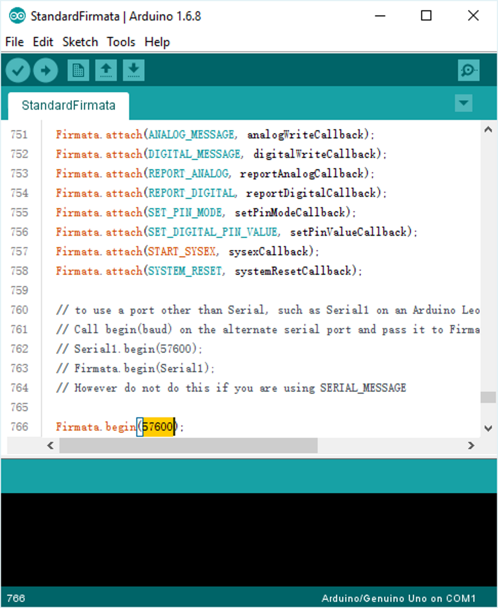

In IoT world, we need access electronics platform for listening some events and processing some actions in real world. Arduino is a kind of popular electronics platform with open source hardware and software for making interactive projects.

## Summary

Windows 10 devices, including PCs, mobile devices (such as phones) and IoT devices, can access Arduino by Windows Remote Arduino library which is an open source Windows runtime component library to allow Makers to control Arduino with following functions though a connection of USB, Bluetooth, Ethernet, Wi-Fi, etc.

- GPIO, including digital and analog I/O, and listen events when pin values are reported or changed.
- Send and receive data between devices over I2C.
- Enable customized commands via Firmata SysEx.

We can use any of the WinRT languages to develop, e.g. C#, C++, JavaScript.

To add reference of the library to our project, we just need add [its NuGet package](https://www.nuget.org/packages/Windows-Remote-Arduino). And you can also go to [its GitHub site](https://github.com/ms-iot/remote-wiring) to get source code.

Windows Remote Arduino builds a communication architecture like a three layers cake.

- Top layer is surface API which is for business logic. It allows for remote control from our code.
- Middle layer is about protocol for meaningful message encoding and decoding.
- Bottom layer is about physical communication to exchange raw data.


Windows Remote Arduino provides a `RemoteDevice` class for us to access Arduino and I will introduce it in later section.

## Set up Arduino device

Firstly, we need upload a Firmata for Arduino to facilitate communication as protocol layer. We will use StandardFirmata sketch because it contains some advanced behaviors, such as SPI transactions. It comes pre-packaged with the Arduino IDE. And it is also used by Windows Remote Arduino.

So we need [download Arduino IDE](https://www.arduino.cc/en/Main/Software) to install in dev machine. After installation, you can find it in all apps of Start menu and it is named Arduino.

Connect the Arduino to dev PC via USB. Here I will use a Uno like board for demo.


You will see the red power LED ON is on.

Then open the IDE.


Please check Board and Port in Tools menu to confirm if the model and name are correct.

Navigate to File > Examples > Firmata > StandardFirmata in menu. It will open a new window with codes of StandardFirmata sketch. Go to setup function, you will find `Firmate.begin(57600)` code which is to connect to the device in 57600 bauds per second. You can change the baud as the value in the manual of your Arduino device.



Click or tap the Upload button which is a round button with a right arrow. The StandardFirmata sketch will deploy to the Arduino device. Then the Arduino device will run this sketch forever unless reprogrammed with a different one.

## Get Arduino device information

Right click Start button at bottom left corner of the screen. Select Device Manager in the context menu. Under Ports (COM & LPT) group, find your Arduino device. Open its property window, go to Details tab. Select Hardware Ids in Property dropbox. You will get its VID (vender ID) and PID (product ID) which are used to identify it via USB.


You may need to save this information if you want to use USB to connect it to remote.

But this is not the only way to connect it. Following are some of others.

- Bluetooth: ID or name.
- Wi-Fi / Ethernet: IP address and port.

We also can list all devices available so that we do not need an identifier to connect the device.

## Create a project in Visual Studio

Open Visual Studio 2015 Update 3 (or higher) to add a Blank App (Universal Windows) project which is used to create UWP.


You can select any of languages supported in UWP and I will use C# to introduce here.

Then install Windows-Remote-Arduino NuGet package for the project. You can execute following command to do so.

```powershell
Install-Package Windows-Remote-Arduino
```

Or you can also use GUI by right click the project and click Manage NuGet packages in context menu to search Windows-Remote-Arduino. Then choose the one in the list to install.


Now, the project has added the references of the libraries.

Then we need add some permissions for the UWP to access hardware and network. Open Package.appxmanifest file in the project and add following code to add USB access capability.

```xml
<DeviceCapability Name="serialcommunication">
  <Device Id="any">
    <Function Type="name:serialPort"/>
  </Device>
</DeviceCapability>
```

And network access permission.

```xml
<Capability Name="privateNetworkClientServer"/>
<Capability Name="internetClientServer"/>
```

You can insert following if you want to add capability for Bluetooth access.

```xml
<DeviceCapability Name="bluetooth.rfcomm">
  <Device Id="any">
    <Function Type="name:serialPort"/>
  </Device>
</DeviceCapability>
```

Then we can begin to develop how to communicate with Arduino device from a Windows 10 device.

## Connection and communication

Open `MainPage.xaml.cs` file and add following namespace using.

```csharp
using Microsoft.Maker.RemoteWiring;
using Microsoft.Maker.Serial;
```

Insert following code to the constructor of the `MainPage` class. This will create a serial stream instance for a USB device. The arguments in the constructor are the VID and PID of the device. We want to use this to target the Arduino device.

```csharp
var usb = new USBSerial("VID_2341", "PID_0043");
```

For Bluetooth device, we can use following code to create the serial stream instance.

```csharp
var bluetooth = new BluetoothSerial("ArduinoUno-D01");
```

The argument is the name or ID.

In the same way, the NetworkSerial class is used for ethernet and Wi-Fi, and DfRobotBleSerial is used for Bluetooth Low Energy (Smart Bluetooth).

Add a property to the `MainPage` class for RemoteDevice instance.

```csharp
private RemoteDevice _arduino; 
```

In the constructor of the `MainPage` class, create a new instance of the RemoteDevice class and pass the serial instance to provide a way to access surface API for Arduino. And then begin to set up the connection. So insert following code to the constructor.

```csharp
_arduino = new RemoteDevice(usb); 
usb.begin(57600); // Need pass baud and serial configuration settings. 
```

The RemoteDevice class has following member methods.

- `// Reads mode or state of a specific digital pin.`

  `public PinMode getPinMode(byte pin_)`

  `public PinState digitalRead(byte pin_)`

- `// Writes mode or state of a specific digital pin.`

  `public void pinMode(byte pin_, PinMode mode_)`

  `public void digitalWrite(byte pin_, PinState state_)`

- `// Gets mode or state of a specific analog pin.`

  `public PinMode getPinMode(string analog_pin_)`

  `public ushort analogRead(string analog_pin_)`

- `// Writes mode or state of a specific analog pin.`

  `public void pinMode(string analog_pin_, PinMode mode_)`

  `public void analogWrite(byte pin_, ushort value_)`

- `// Disposes the instance.`

  `public void Dispose()`

And following events.

- `public event RemoteDeviceConnectionCallback DeviceReady`

- `public event RemoteDeviceConnectionCallbackWithMessage DeviceConnectionFailed`

- `public event RemoteDeviceConnectionCallbackWithMessage DeviceConnectionLost`

- `public event DigitalPinUpdatedCallback DigitalPinUpdated`

- `public event StringMessageReceivedCallback StringMessageReceived`

- `public event SysexMessageReceivedCallback SysexMessageReceived`

- `public event AnalogPinUpdatedCallback AnalogPinUpdated`

And following properties.

- `public HardwareProfile DeviceHardwareProfile { get; }`

- `public TwoWire I2c { get; }`

So we can use these to access the Arduino device.

## Turn on LED

In Uno, there is a green LED L on the board which is connected with digital pin 13. So we can set this pin to OUTPUT mode and HIGH state to turn on.

```csharp
public void Setup()
{
    _arduino.pinMode(13, PinMode.OUTPUT);
    _arduino.digitalWrite(13, PinState.HIGH);
}
```

And insert following code in the constructor of the `MainPage` class to register this delegate to the event for device is read.

```csharp
_arduino.DeviceReady += Setup;
```


The LED will be on when the app runs. Let's have a test.


It works as what we expect.


And you can also connect further things through a breadboard by wires in a current circuit, such as to use wires connect following one by one.

1. Power pin 3.3V on Uno.
2. A LED on breadboard.
3. A resistor on breadboard.
4. Digital pin 6 on Uno.

So we can control the LED on/off on the breadboard.


Update the Setup() method as following to update digital pin 6.

```csharp
private int _pin = 6;

public void Setup()
{
    _arduino.pinMode(_pin, PinMode.OUTPUT);
    _arduino.digitalWrite(_pin, PinState.HIGH);
}
```

Then the LED will be on now when we run the app.


It will be better if we update the UI to support toggle LED.

## App UI

To toggle LED from on to off and from off to on, we need add following member property and method in the `MainPage` class.

1. Add a property indicating whether the LED is on.
2. Add a method to check the property and to turn on/off the LED.

Code is following.

```csharp
public bool IsOn
{
    get
    {
      _arduino.digitalWrite(_pin, value ? PinState.HIGH : PinState.LOW);
    }

    set
    {
        switch (_arduino.digitalRead(_pin))
        {
            case PinState.HIGH:
                return true;
            case PinState.LOW:
                return false;
        }

        return false;
    }
}

public void Toggle()
{
   IsOn = !IsOn;
}
```

And we need update Setup() method.

1. Set its pin mode as OUTPUT.
2. Read its pin state.
3. Set property IsOn of the `MainPage` class to the correct value by the pin state.

Code is following.

```csharp
private void Setup()
{
    _arduino.pinMode(_pin, PinMode.OUTPUT);
}
```

Then add a button in UI to call `Toggle()` method when click or tap. The app can run in PCs, mobile phones, IoT devices, etc.

Enjoy!
