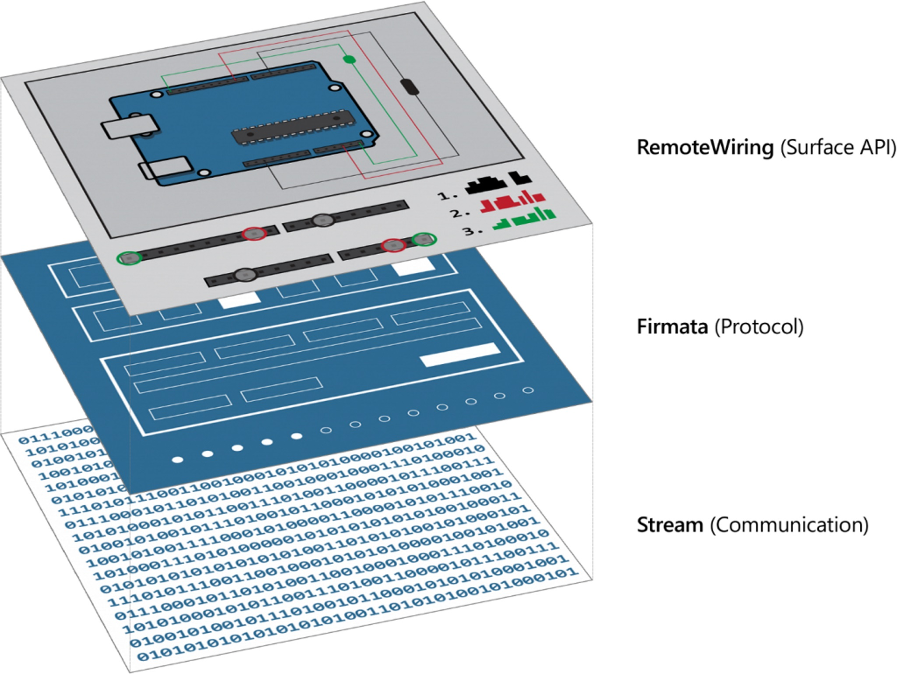
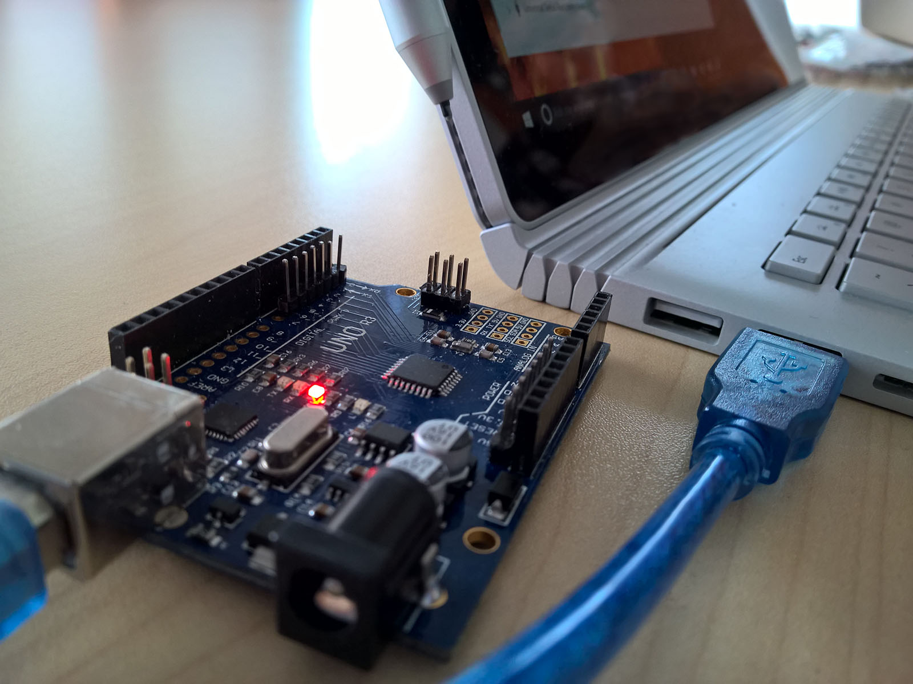
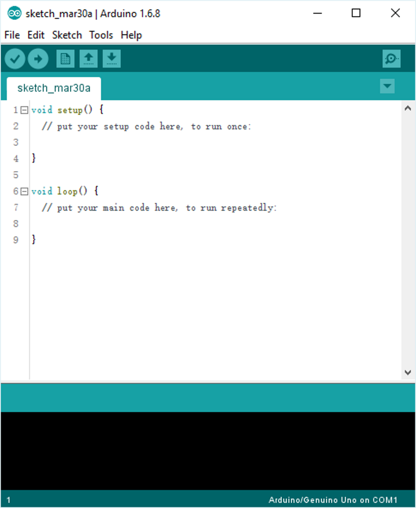
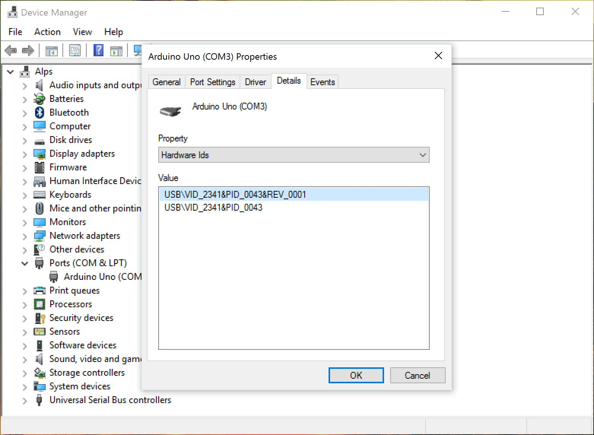
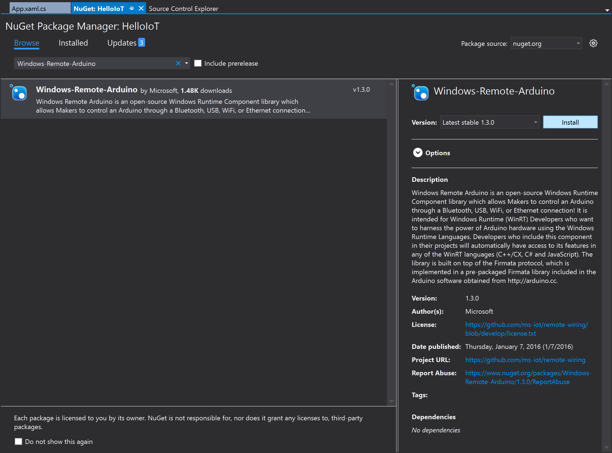
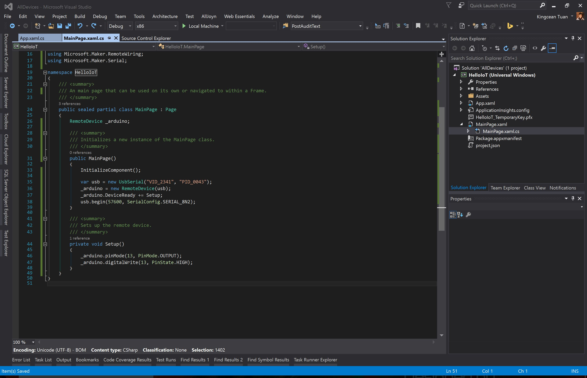
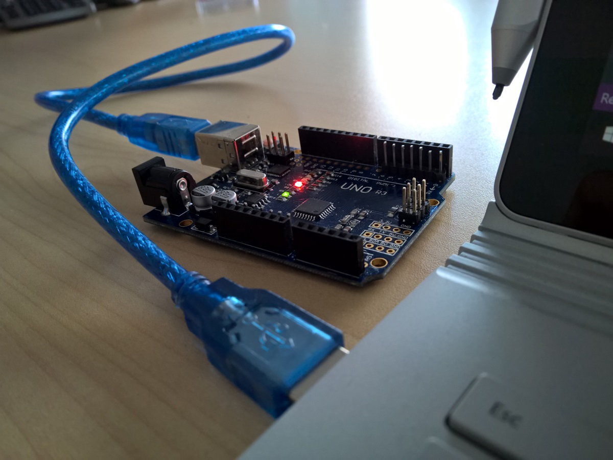
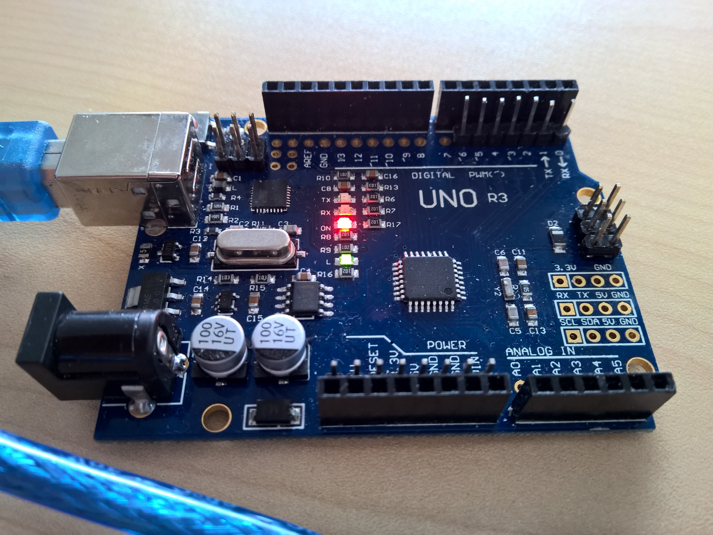

在物联网（即 IoT）世界里，我们经常需要监听和操作一些开发板，从而在真实的世界里感知某些信息或执行某些动作。Arduino 是一个非常流行的开发板，物美价廉，并基于 Creative Commons 许可开源，创客们可以随意发挥自己的想象空间以进行创意。

## 基本介绍

通过 Windows 10 设备，无论是电脑，抑或移动设备（如手机），甚至 IoT 设备，都可以通过 USB、蓝牙、Wi-Fi、有线局域网等方式，连接到 Arduino 开发板，以实现以下具体的访问方式。

- GPIO，包括数字和模拟的读和写，以及监听Pin的回报和修改
- 通过 I2C 进行数据的发送和接收
- 通过 Firmata SysEx 定制命令

由于是采用 Windows 通用应用，即 UWP，因此可以使用任何 WinRT 支持的语言，如 C#、C++、JavaScript 等。

我们需要先引用开源的 Windows Remote Arduino 程序集，可以通过 [NuGet](https://www.nuget.org/packages/Windows-Remote-Arduino) 添加到我们自己的项目中去。

或者也可以通过以下 [GitHub](https://github.com/ms-iot/remote-wiring) 地址获取源码。

该程序集是Windows运行时组件，在实现 Windows 10与 Arduino 之间通信访问上，将其整体软件架构分为三层。

- API 层 – RemoteWiring。 
抽象出来的接口，可用于远程控制器访问 Arduino设备。这是我们的业务代码主要操作的通信层。
- 协议层 – Firmata。 
提供消息信息的传递。
- 物理通信层 – 二进制流。
Windows 设备和Arduino 设备之间的原始数据通信。



之后，我们便可以使用其封装的 `RemoteDevice` 基类来访问目标设备了。

## 设置 Arduino 设备

如果希望 Arduino 进行某些定制的操作，我们需要对其进行设置。

首先，我们需要写入 Arduino 的 Firmata。由于 Windows 10 设备变成开发默认支持 Arduino 的 StandardFirmata 实现，因此，我们需要先将该 Sketch 部署到 Arduino 设备中。
 我们需要用到 Arduino IDE，因为其包含部署的核心功能以及 StandardFirmata。该 IDE 软件可以在 [Arduino 官网](https://www.arduino.cc/en/Main/Software)中下载到。

下载后，需要安装到开发计算机中。安装后，该软件的名称显示为 Arduino。

接下来需要使用 USB 将 Arduino 设备与开发计算机连接。我们这里使用一个经过我们自行改造的类似 Uno 的设备进行演示。你可以在网上购买或自行组装一台 Arduino 设备，但可能接下来的部分设置会略有不同，但大体上差不多。



连接后，可以看到设备的红色电源灯 ON 被点亮。

然后运行 Arduino IDE。默认情况下，会初始化一个 Sketch，里面预设了 `setup()` 函数和 `loop()` 函数，前者只会运行一次，后者会被不停地调用到。



然后在该软件的 Tools 菜单中，确认你的设备的型号和名字分别出现在 Board 和 Port 子菜单中。

接下来，在菜单中依次选择 File > Examples > Firmata > StandardFirmata 将打开一个新窗口，里面已经包含了该 Sketch。这时，请留意其中 setup() 方法里，有一处关于可配置波特率的设定，默认情况下被设置为 57600 bps，你可以根据你的 Arduino 设备说明书修改为合适的值。

点击 发布 按钮（一个包含向右粗箭头的圆形按钮），将该 Sketch 部署到你的 Arduino 设备当中去。此后，该 Sketch 将一直存在于该设备中，直到下次重新部署时被覆盖。

## 获取 Arduino 设备信息

如果需要连接到某个指定的设备，首先需要获取设备信息。

在开发计算机中，右键屏幕左下方“开始”按钮，打开 设备管理器，在其中的 Ports (COM & LPT) 分类下，找到你的这个 Arduino 设备。然后打开其属性，并进入 详细 选项卡，在属性下拉框中选择 Hardware Ids，下面会显示其 VID 和 PID，前者是厂商代码（即 Vender ID），后者是产品编号（即 Product ID），这些信息将可用于标识你的这台 USB 连接设备。



如果需要用 USB 进行连接，则需要保存这些信息，在之后的过程中，这将会起到作用。

或者，也可以通过其它方式进行连接，并可以存储一下信息。

- 蓝牙，需要设定该设备在蓝牙可见中的名称或 ID。
- Wi-Fi 或有线网络，需要 IP 地址。

当然，你也可以枚举连接到的所有设备的信息，从而不需要使用诸如 ID 这类信息进行事先绑定。

## 在 Visual Studio 中创建项目

在 Windows 上开发，我们自然就会用到 Visual Studio 开发环境啦。

打开 Visual Studio 2015 Update 3（或更高版本），创建一个新的 Blank App (Windows Universal) 项目，即用于创建 UWP 的空项目。


由于 UWP 项目支持多种语言编写，本文将以 C# 做为编程语言来叙述。

然后通过 NuGet 安装 Windows-Remote-Arduino 程序集。你可以通过以下命令进行。

```powershell
Install-Package Windows-Remote-Arduino
```

也可以右键项目文件，选择管理 NuGet 包，然后在 浏览 选项卡中，搜索 Windows-Remote-Arduino 并在列表中找到该程序引用包进行安装。



然后在项目中打开 Package.appxmanifest 配置文件，增加一下代码，以标明该项目希望获取 USB 访问权限。

```xml
<DeviceCapability Name="serialcommunication">
  <Device Id="any">
    <Function Type="name:serialPort"/>
  </Device>
</DeviceCapability>
```

以及网络访问权限。

```xml
<Capability Name="privateNetworkClientServer"/>
<Capability Name="internetClientServer"/>
```

如果你希望同时还有蓝牙访问权限，可以将以下代码一并加上。

```xml
<DeviceCapability Name="bluetooth.rfcomm">
  <Device Id="any">
    <Function Type="name:serialPort"/>
  </Device>
</DeviceCapability>
```

然后，我们将可以开始在项目中实现与 Arduino 设备的连接和通信。

## 连接与通信

现在，我们来编程实现最基本的连接和通信。打开项目中的 MainPage.xaml.cs 文件，加入以下引用。

```csharp
using Microsoft.Maker.RemoteWiring;
using Microsoft.Maker.Serial;
```

在其 MainPage 类的构造函数中，添加以下代码，从而创建一个 USB 设备的引用，之后可以通过这个引用与这个 USB 设备进行通信。我们需要将该 USB 设备的 VID 和 PID 传入进去。

```csharp
var usb = new USBSerial("VID_2341", "PID_0043");
```

若需要创建蓝牙设备的引用，可以使用下面的代码。

```csharp
var bluetooth = new BluetoothSerial("ArduinoUno-D01");
```

其中的参数是设备在蓝牙发现中的名称或 ID。

同理，还可以使用 NetworkSerial 类来创建网络连接的设备引用，或者使用 DfRobotBleSerial 类来创建低功耗蓝牙设备的引用。

然后为 MainPage 类添加以下 RemoteDevice 类型的属性，用于记录对 Arduino 设备的引用。

```csharp
private RemoteDevice _arduino; 
```

当有了这个引用之后，便可以使用下述方法获取该 Arduino 设备的引用，从而实现进一步的访问。

在 MainPage 的构造函数中，加入一下代码，以初始化刚刚添加的 RemoteDevice 属性，从而方便之后对该 Arduino 设备的访问。然后，连接 USB，并传入波特率。

```csharp
_arduino = new RemoteDevice(usb); 
usb.begin(57600); // Need pass baud and serial configuration settings. 
```

其返回的 RemoteDevice 对象，包含以下重要事件。

- `// 在设备连接成功后触发。`

  `public event RemoteDeviceConnectionCallback DeviceReady`

- `// 在设备连接失败后触发。`

  `public event RemoteDeviceConnectionCallbackWithMessage DeviceConnectionFailed`

- `// 在设备掉线时触发。`

  `public event RemoteDeviceConnectionCallbackWithMessage DeviceConnectionLost`

- `// 在收到数字 Pin 更新时触发。`
  `public event DigitalPinUpdatedCallback DigitalPinUpdated`

- `// 在收到文本消息时触发。`

  `public event StringMessageReceivedCallback StringMessageReceived`

- `// 在收到 SysEx 消息时触发。`
  `public event SysexMessageReceivedCallback SysexMessageReceived`

- `// 在收到模拟 Pin 更新时触发。`
  `public event AnalogPinUpdatedCallback AnalogPinUpdated`

另外，还有许多非常实用的方法，如以下这些。

- `// 对数字 Pin 进行读取。`

  `public PinMode getPinMode(byte pin_)`

  `public PinState digitalRead(byte pin_)`

- `// 对数字 Pin 进行写入。`

  `public void pinMode(byte pin_, PinMode mode_)`

  `public void digitalWrite(byte pin_, PinState state_)`

- `// 对模拟 Pin 进行读取。`

  `public PinMode getPinMode(string analog_pin_)`

  `public ushort analogRead(string analog_pin_)`

- `// 对模拟 Pin 进行写入。`

  `public void pinMode(string analog_pin_, PinMode mode_)`

  `public void analogWrite(byte pin_, ushort value_)`

- `// 销毁。`

  `public void Dispose()`

另外还有以下属性。

- `// 获取设备信息。`

  `public HardwareProfile DeviceHardwareProfile { get; }`


- `// 获取 I2C 操作对象。`

  `public TwoWire I2c { get; }`

由此，你可以很方便的对所连接的 Arduino 设备进行访问控制。

## 点亮 LED 灯

掌握了如何通过 Windows 10 与 Arduino 进行连接和通信，我们可以做一些简单的访问控制了。通常，人们在除此了解一门计算机语言或平台时，会写一个 Hello World 的程序来做测试；但在物联网开发中，通常是先尝试着点亮一盏 LED 灯。

在 Uno 上，有一个绿色的 LED 灯 L，它已经被串联在数字 Pin 13 上，因此，我们只需将该 Pin 的模式设置为输出，以及将其值设置为高电压，那么该 LED 就会被点亮。

```csharp
public void Setup()
{
    _arduino.pinMode(13, PinMode.OUTPUT);
    _arduino.digitalWrite(13, PinState.HIGH);
}
```

然后将这个方法注册在设备连接就绪的事件上。

```csharp
_arduino.DeviceReady += Setup;
```



当运行这个 App 的时候，该 LED 就会亮起。我们来测试一下看看结果。



可以看到，正如我们想想的那样。



另外，我们还可以用导线将 Arduino 与面包板进行连接，从而和更多电子元件进行串连。例如，我们可以按照以下端口进行串联。

1. Uno 上的 3.3V 电源端口。
2. 面包板上的一枚 LED 灯泡。
3. 面包板上的一个电阻。
4. Uno 上的数字 Pin 6。

现在，我们计划对该面包板上的 LED 等进行控制。


将之前的 `Setup()` 方法进行如下修改，从而更新数字 Pin 6 的模式和值。

```csharp
private int _pin = 6;

public void Setup()
{
    _arduino.pinMode(_pin, PinMode.OUTPUT);
    _arduino.digitalWrite(_pin, PinState.HIGH);
}
```

运行该 App 之后，你会发现该 LED 的确亮了。


接下来，我们还需要对 App 进行一些改进，以支持基本的交互。

## 添加 App UI

我们现在可以在运行 App 的时候点亮 LED，那么接下来呢？这时，我们需要创建一个 UI 来进行控制该 LED 的开与关。为此我们需要先在 `MainPage` 类中加入以下成员属性和方法。

1. 增加一个成员属性，用于记录 LED 是否处于开启状态。
2. 增加一个成员方法，其会先检测当前 LED 的开关状态，然后根据情况执行熄灭或点亮的操作。

代码如下。

```csharp
public bool IsOn
{
    get
    {
      _arduino.digitalWrite(_pin, value ? PinState.HIGH : PinState.LOW);
    }

    set
    {
        switch (_arduino.digitalRead(_pin))
        {
            case PinState.HIGH:
                return true;
            case PinState.LOW:
                return false;
        }

        return false;
    }
}

public void Toggle()
{
   IsOn = !IsOn;
}
```

同时更新 `Setup()` 方法。

1. 设置该 Pin 模式为输出。
2. 读取 Pin 值。
3. 设置 MainPage 类的 IsOn 属性。

代码如下。

```csharp
private void Setup()
{
    _arduino.pinMode(_pin, PinMode.OUTPUT);
}
```

然后，在界面中添加一个按钮，当按下或点击时，调用 `Toggle()` 方法。

这个 App 可以在 PC、手机、IoT 设备中运行。
