水滴威胁着地球上人类的安全，万众匹夫责无旁贷，响应联合国号召，献身星际事业捍卫大家利益，用自己的智慧和行动推进和平发展，不畏艰险勇往向前。

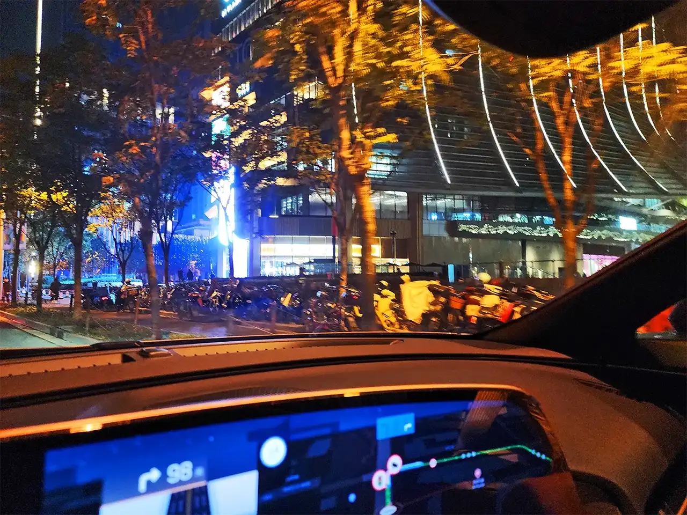

嘘，夜深了，悄无声息自驾前往总部报道，安全平稳一路前行，没有遇到智子的破坏。就要到达目的地了，看来人类和三体达成的和平协议目前还是很有效的。

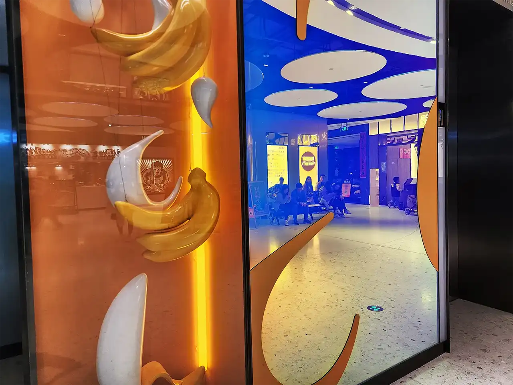

先吃个晚饭吧，俗话说得好，人是铁、饭是钢，当然新鲜可口的菜肴也是必须的，好好吃上一餐才有后续的动力，毕竟比美食更重要的事情不是太多。

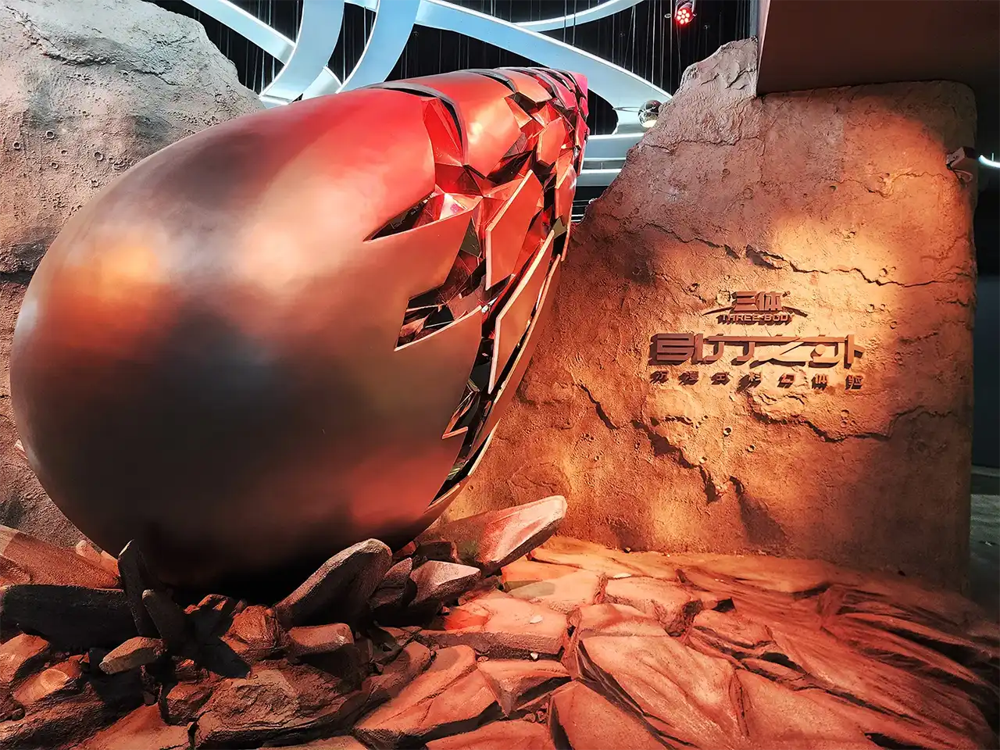

排队候场中，凡事都要讲究个秩序，这是星际宝贝哦不对，是星际舰队成员的重要素质。带上身份手表，即将进入太空港。

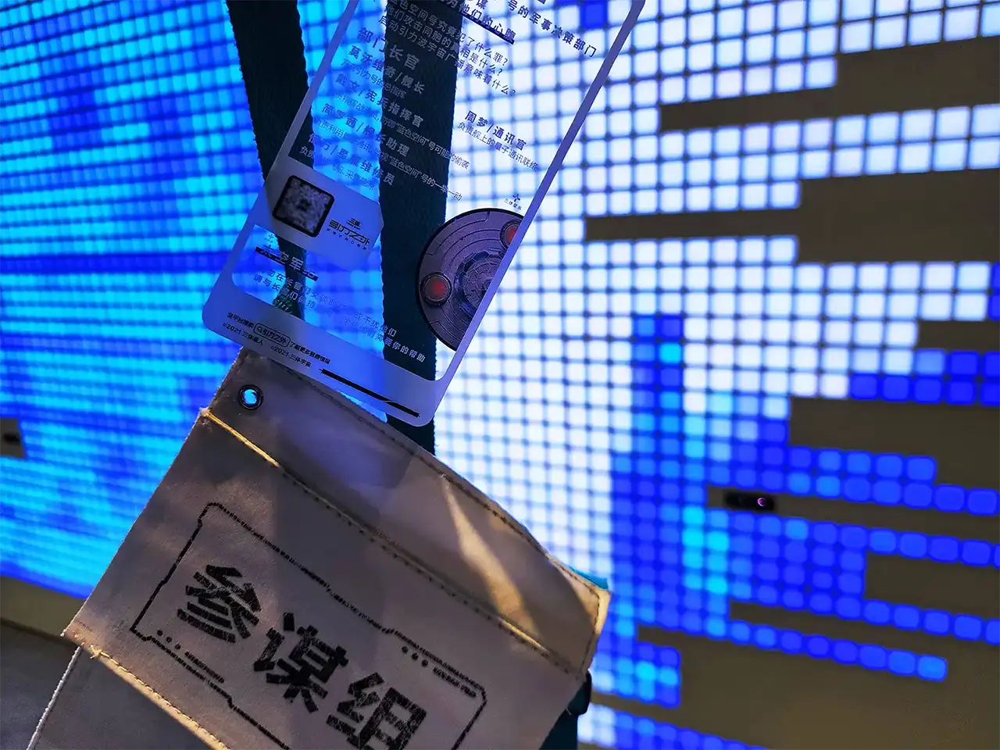

忘记介绍了，我是参谋组的成员，需要在飞船上完成许多重要任务，肩负使命，不容出错。

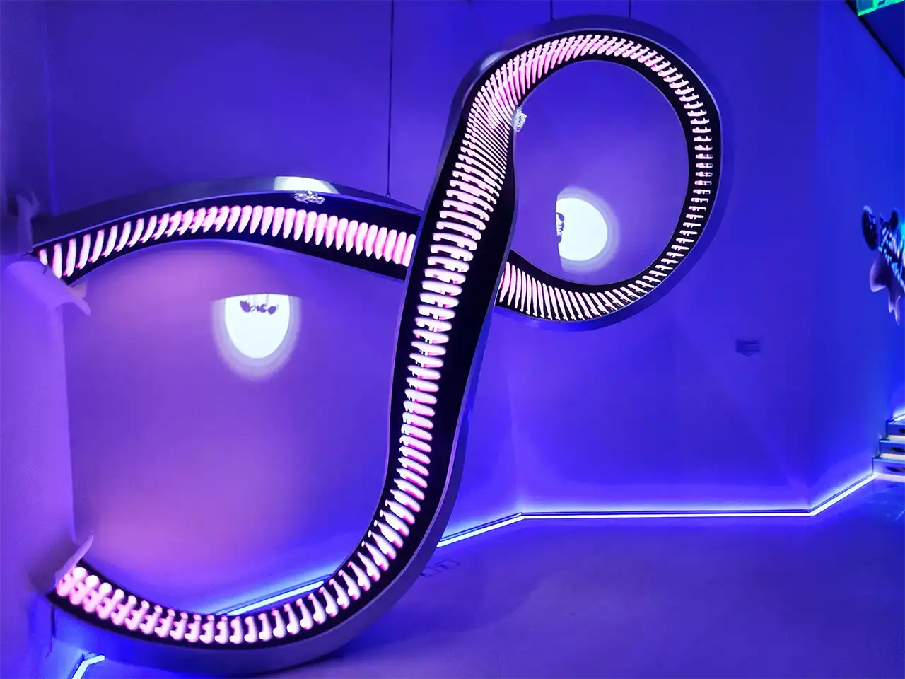

马上就要登舰了，先前往太空电梯，随着快速上升，脚下的世界飞快远离我们，变成了一个巨型蓝色弹珠，随着速度缓缓减慢，来到了太空港，踏上新一轮征途。

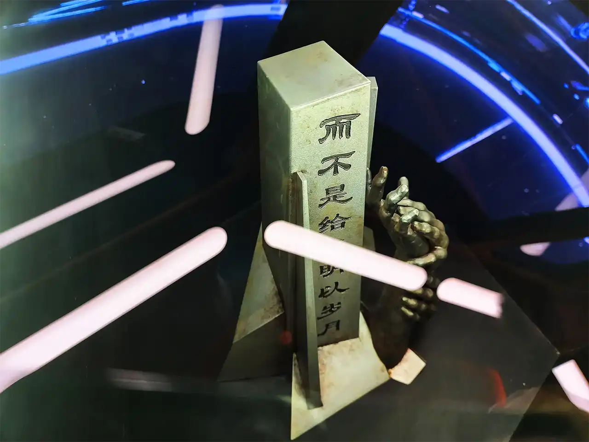

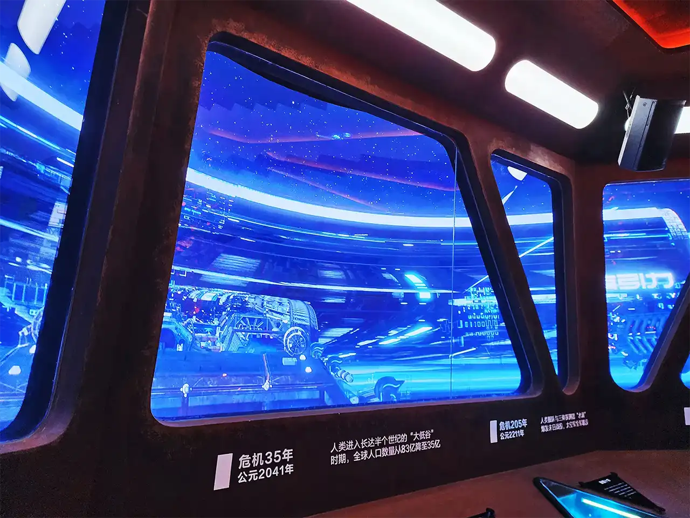

里面陈列着人类历史许多非常重要的里程碑，起起落落无数载，世间万物无尽变化，更难以忘怀。随后便通过廊桥开始登上星舰。

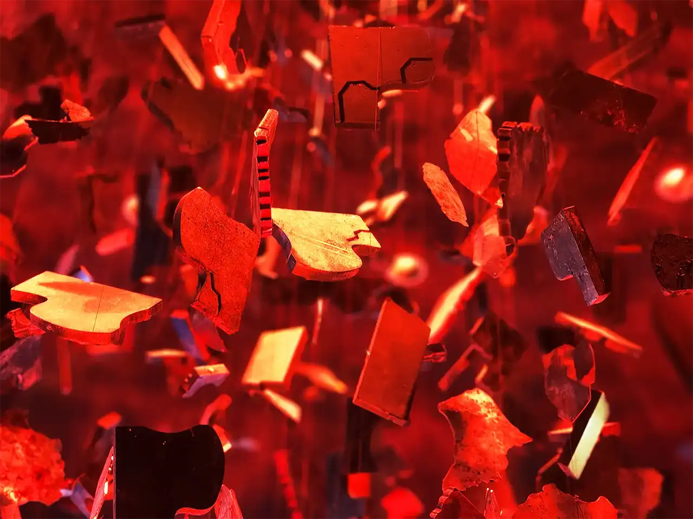

在黑暗丛林法则的影响下，任何璀璨文明都要小心谨慎，抓紧发展且不能大意。为了对我们的文明保驾护航，星舰成了我们的行动和利器。可是据称蓝色空间号却袭击了我们的同胞伙伴，训练有素的我们为此一路追捕，转眼就是半个世纪。

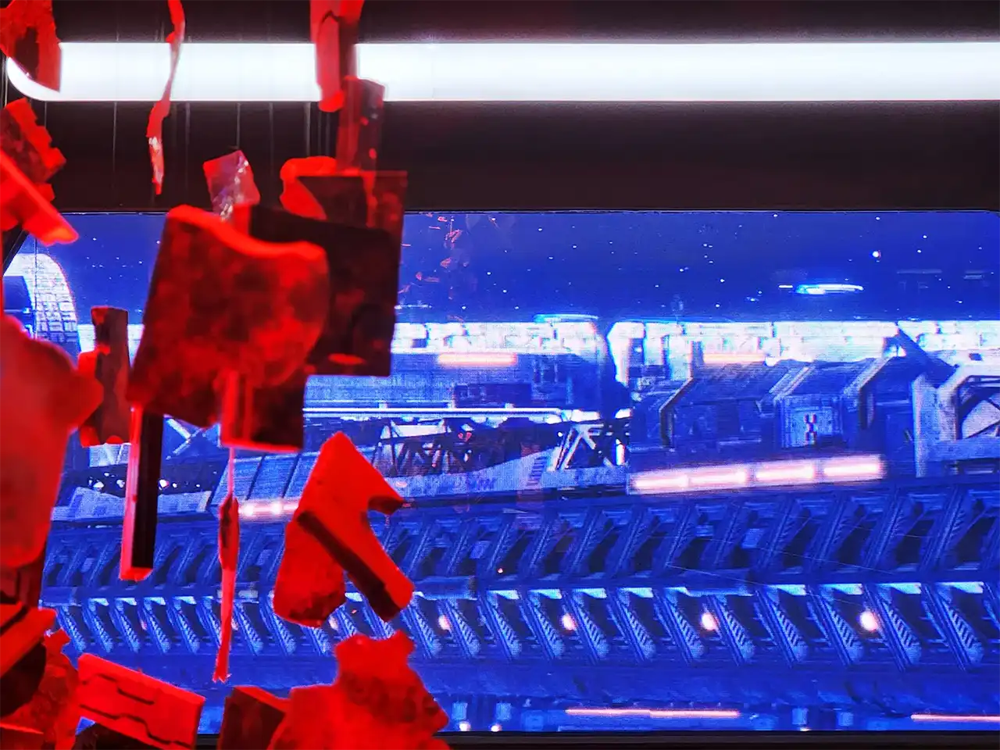

跟随着有勇无谋却戏份很足的宪兵指挥官，经历了许多奇幻事件，我们一路追击打算逮捕的星际战舰，仿佛有着自己的故事。

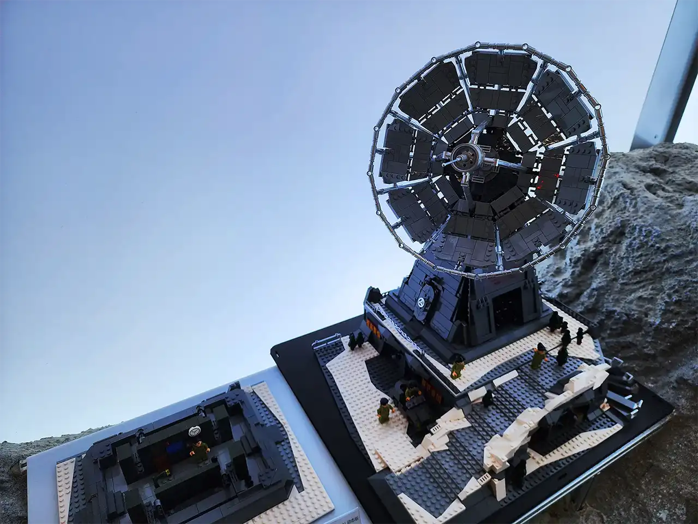

随着持剑人的更替，遥远的地球似乎遇到了更大的灾难，三体向我们发动了进攻。最终，经全体投票表决，我们还是启用了飞船上的引力波天线，太阳系和三体世界都将暴露自己的坐标。

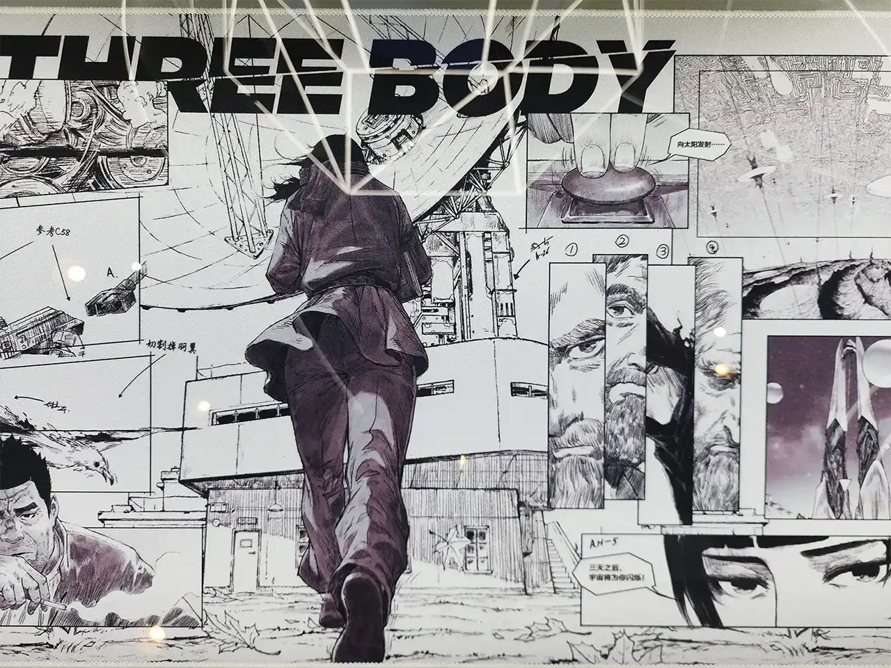

再见了朋友们，希望大家能充分利用最后一点时间进行逃跑，这实在是无奈的选择，也许一切早已注定，历史的进程只是这样一个投影。

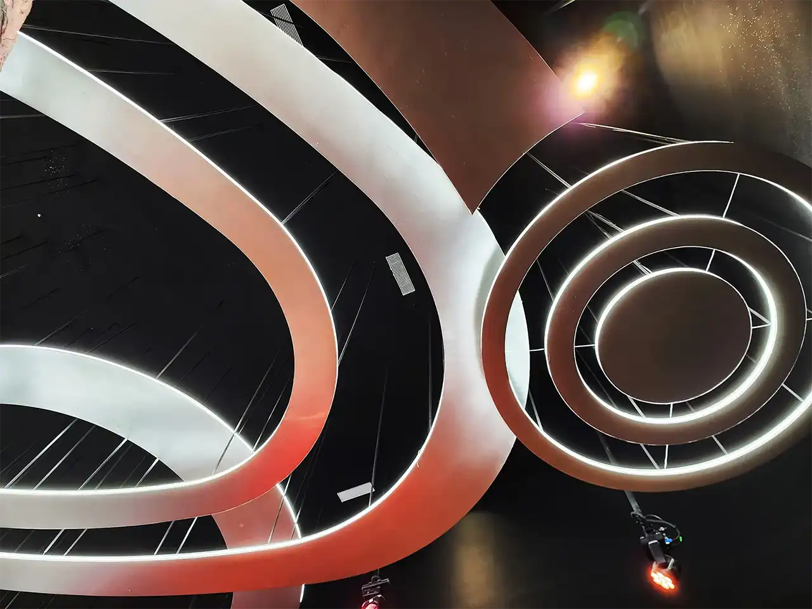

只能说，我当时投的是反对票，可千万不要怪我，浩瀚宇宙终将给我们留下后路和新的家园，坚信希望和梦想都能被一一实现。

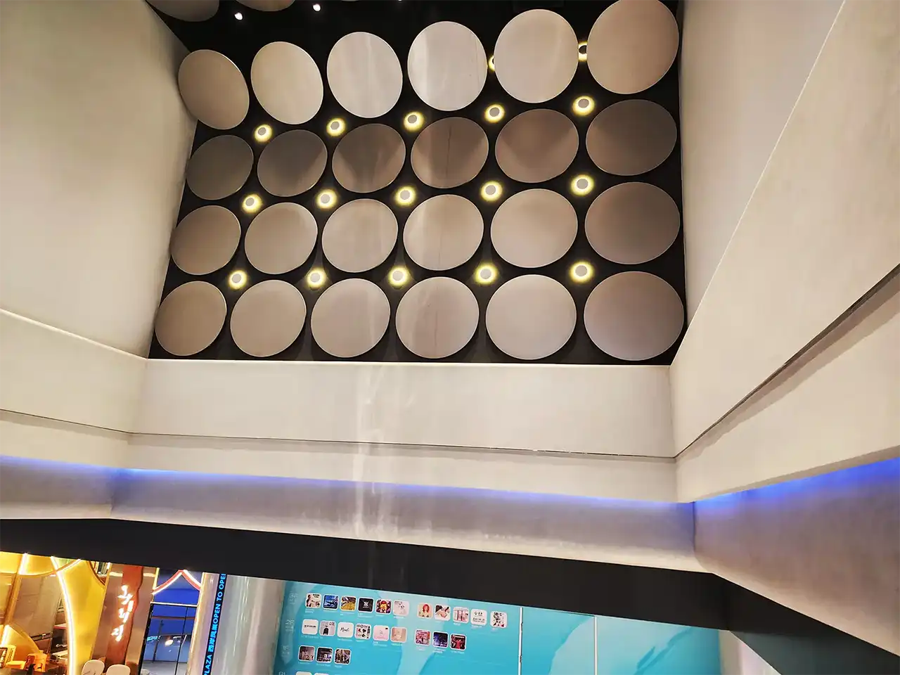

大家晚安！望以后更是灿烂幸福，星辰大海，以及能做自己喜欢且有意义的事情。
