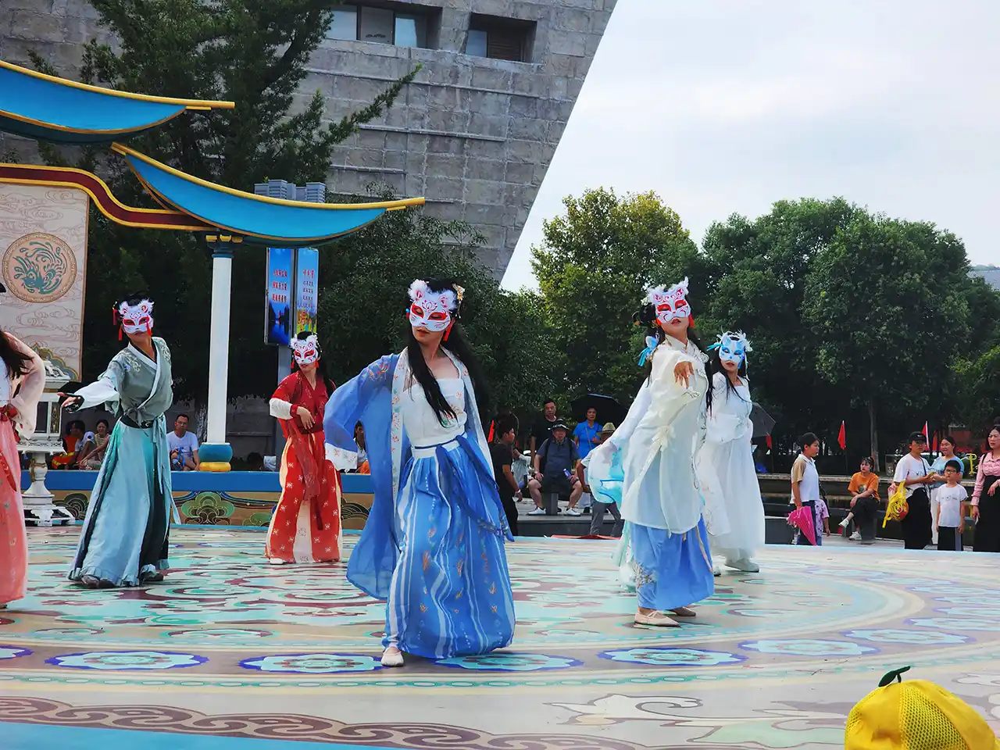
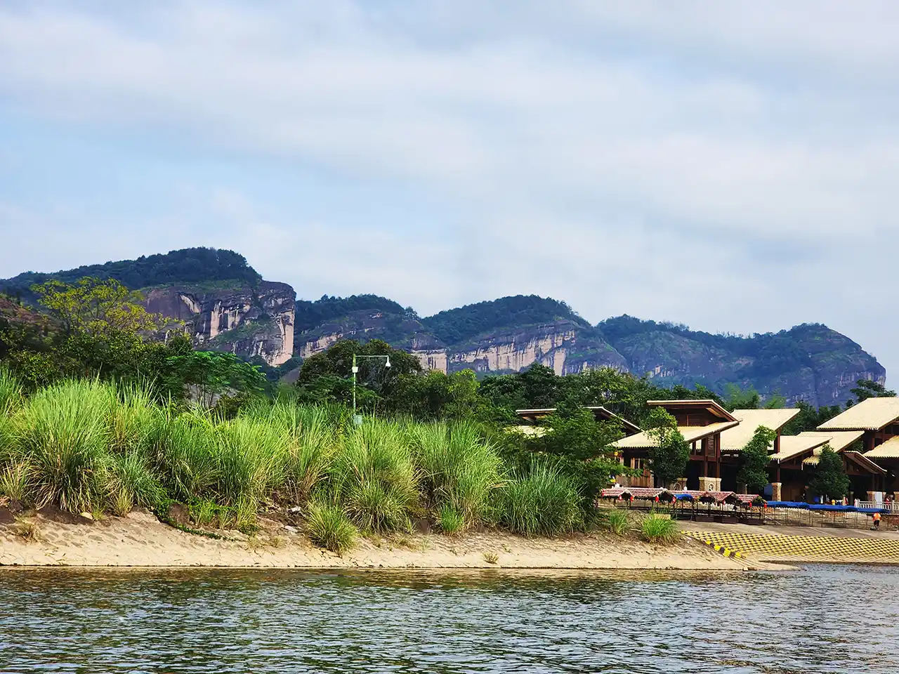
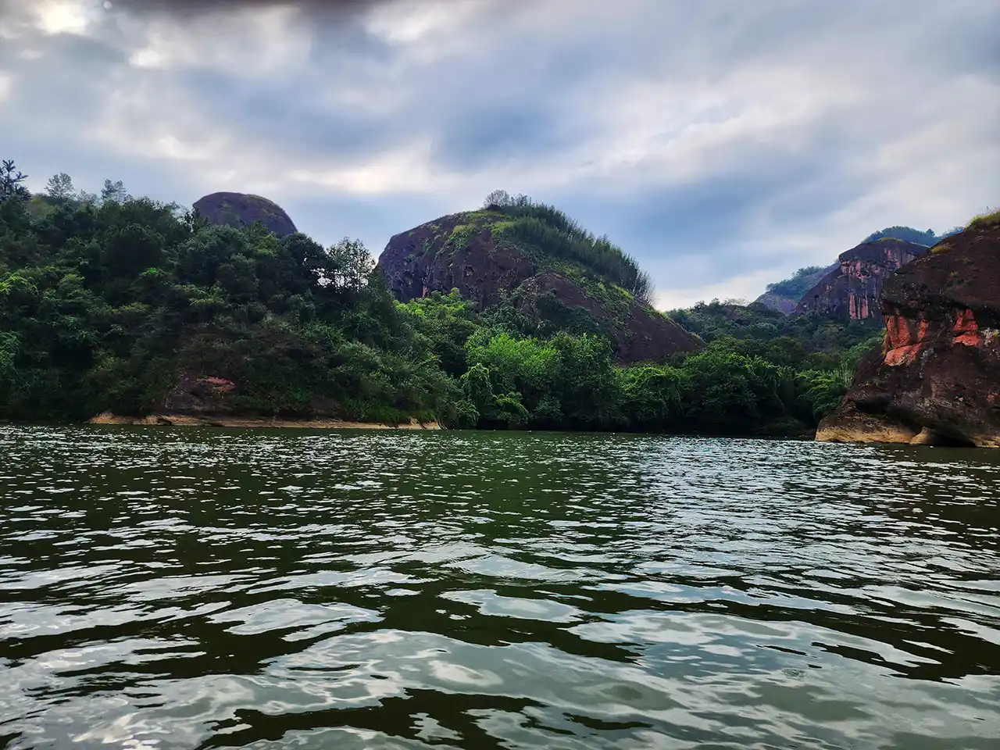
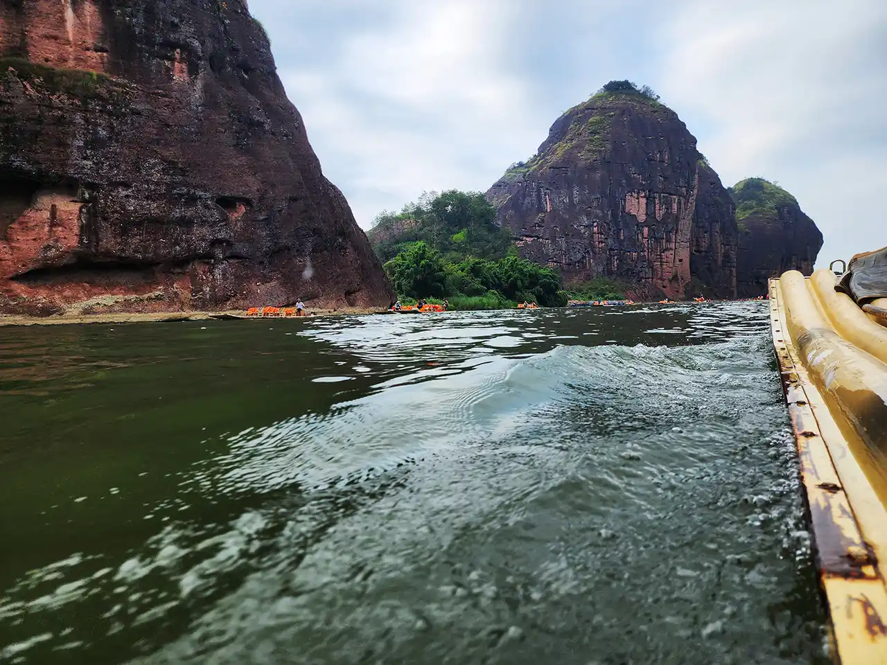
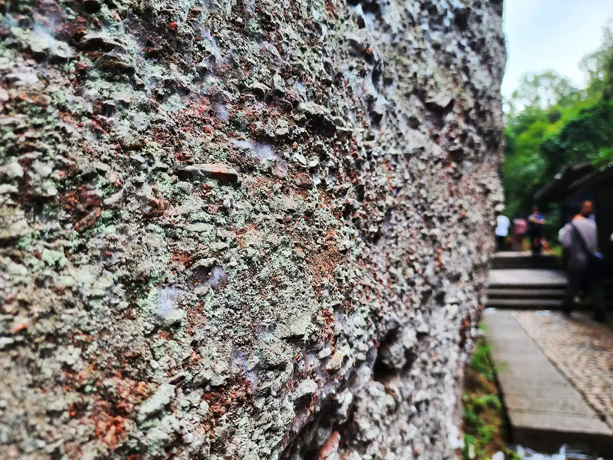
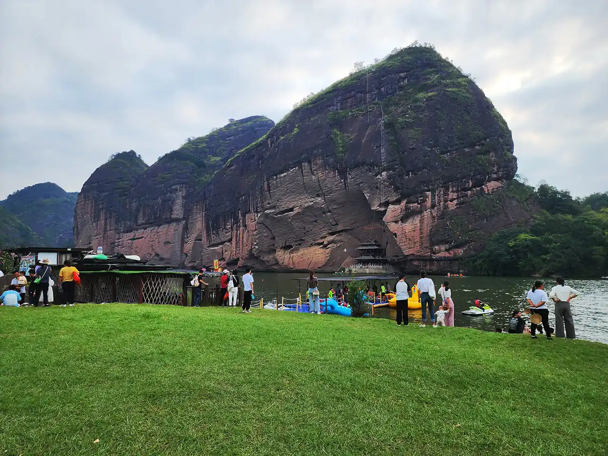
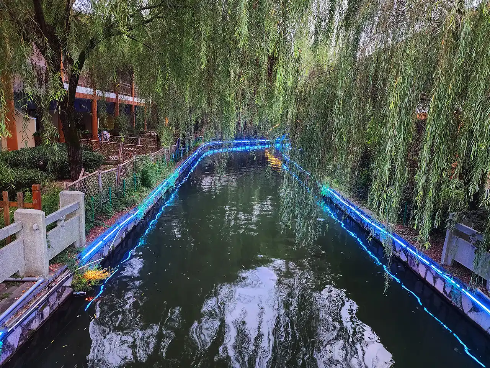
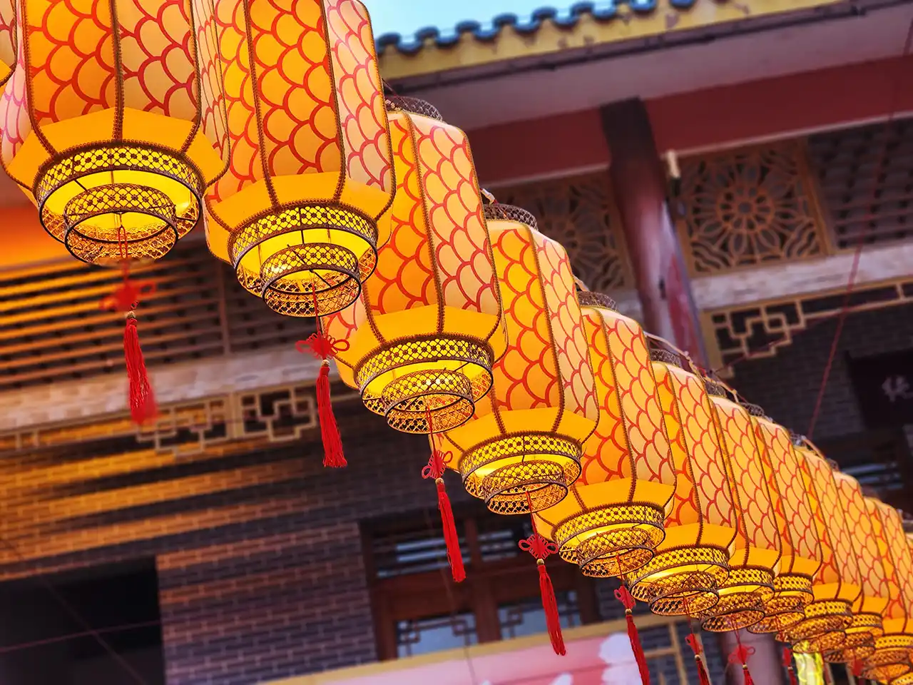
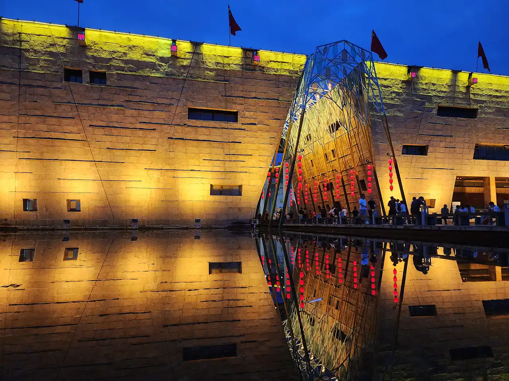

东汉中叶，正一道创始人张道陵天师，在今鹰潭距市中心西南20公里处原云锦山上，炼制仙丹，据传，丹成而龙虎现，山因而得名，典型的丹霞地貌风景。

## 入场

从停车场出来，沿着一条顶上由仿古伞悬挂而成的意境小路行走，尽头便是大门，门外歌舞表演，入口位于其后。

由于是道教发祥地，号称道都，故印有太极图等符号。验票进入后，便可乘观光大巴或景观车前去其中各处景点，包括象鼻山等，有栈道，非常方便。

## 竹筏

龙虎山属水上丹霞，因此乘竹筏游览是必不可少的。船首船尾各一执船者，并沿途介绍着风景。竹筏实际已现代化，竹筏外形款式，且装有马达，仅离港一小段距离会由人工滑行体验。

岸边风景奇特秀丽。再加一下想象力，那周边的小山更是说什么像什么。岩壁颜色多样好看，由多种成因导致，包括矿物质、风化、鸟粪等。

竹筏继续在水中行驶，周围也有许多其他竹筏，非常灵动。两边还有悬棺，只需仔细观看便很容易发现。

## 徒步

登岸后，可登台阶至半山处。向前一点便是仙女岩，又称大地之母，鉴于形状太奇特了我就不放图了，除了上面这张非常近距离的一个不重要的小局部特性。

沿着湖边走，来到一处浮桥，彩色的木板下是一艘艘锈迹斑斑的小船，铁索上绑着许多写有祝福语的飘扬红条。

穿过浮桥，便是一片绿茵茵的草地，可隔湖眺望对面的山。湖中水上项目也很多彩，摩托艇拉着后面的气垫船在快速游弋转圈。岸边人们休息和拍照，非常悠闲。

## 古越水街

乘坐景区车返回，来到水上古镇，龙和虎在其中到处可见，到处都有装点的景致。

随便走走也是一件开心的事情，整洁干净的小街道，两边颇有特殊的仿古建筑，与常见的传统江南园林风格略有不同。

## 夜深人不静

回到大门，寻梦龙虎山，现代与古典交融，自然与人文并重，传统不失时尚，休闲娱乐自在。

不早了，欢快的时光总是过得很快，还好记忆长存，未来也会更可期。
