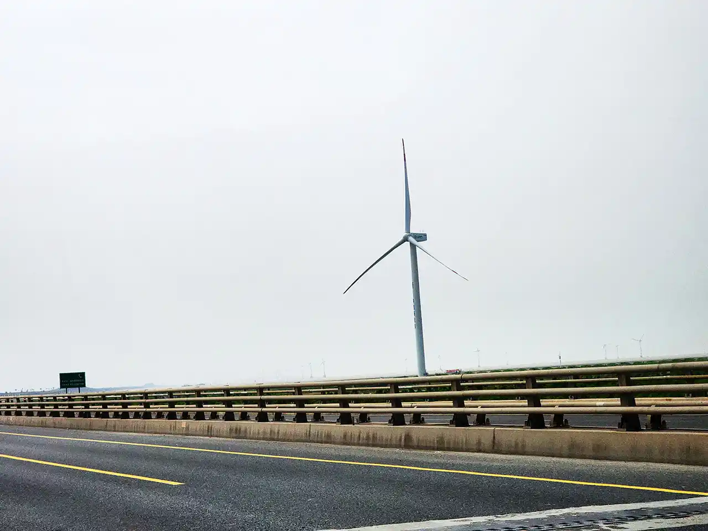
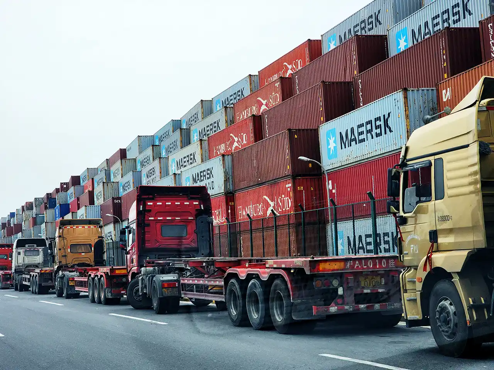
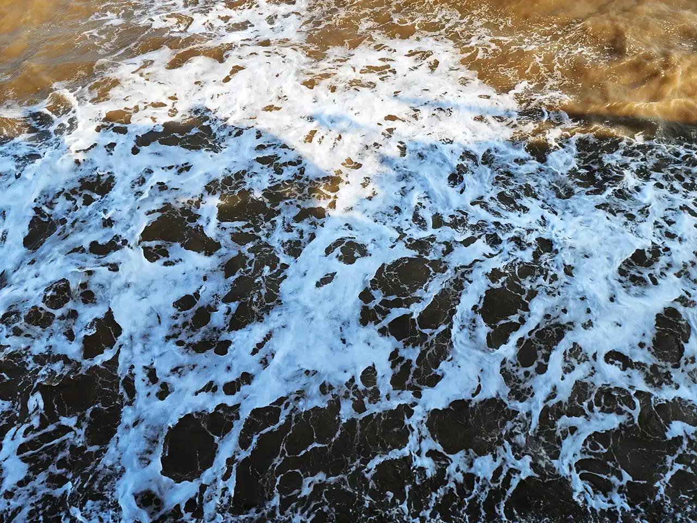
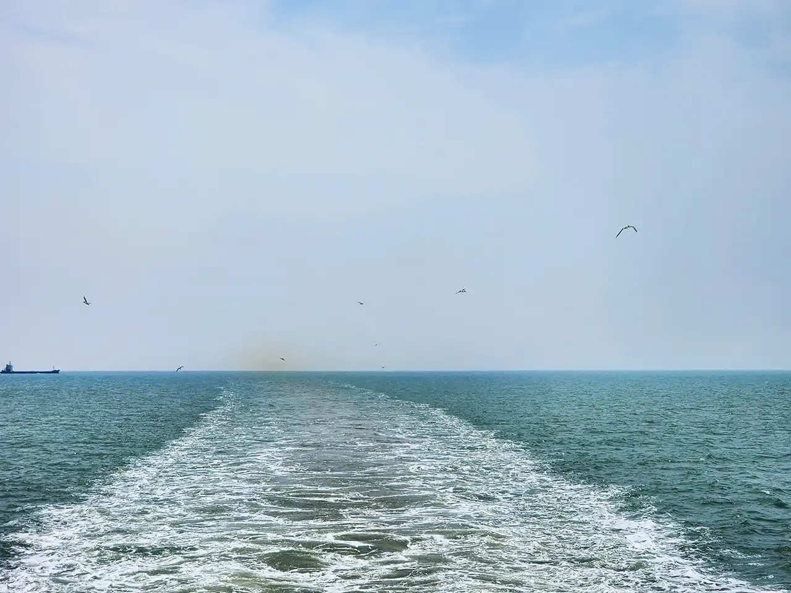
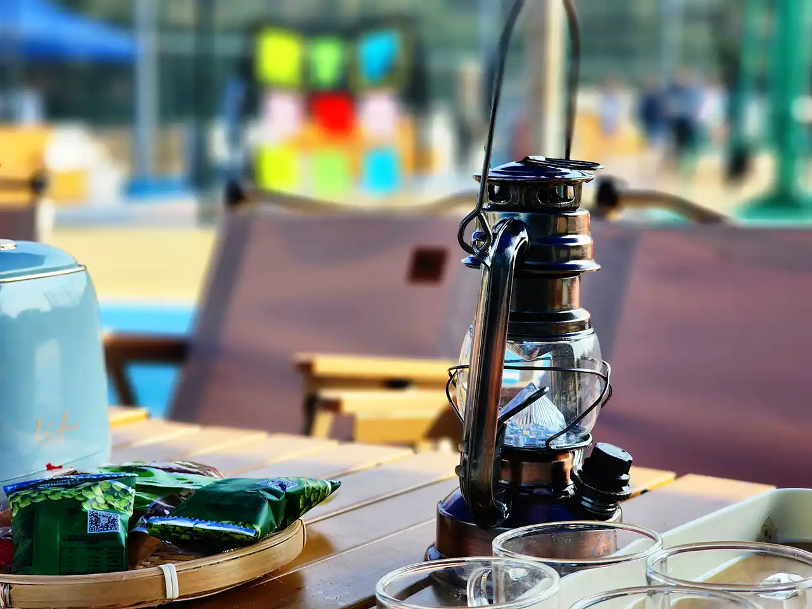
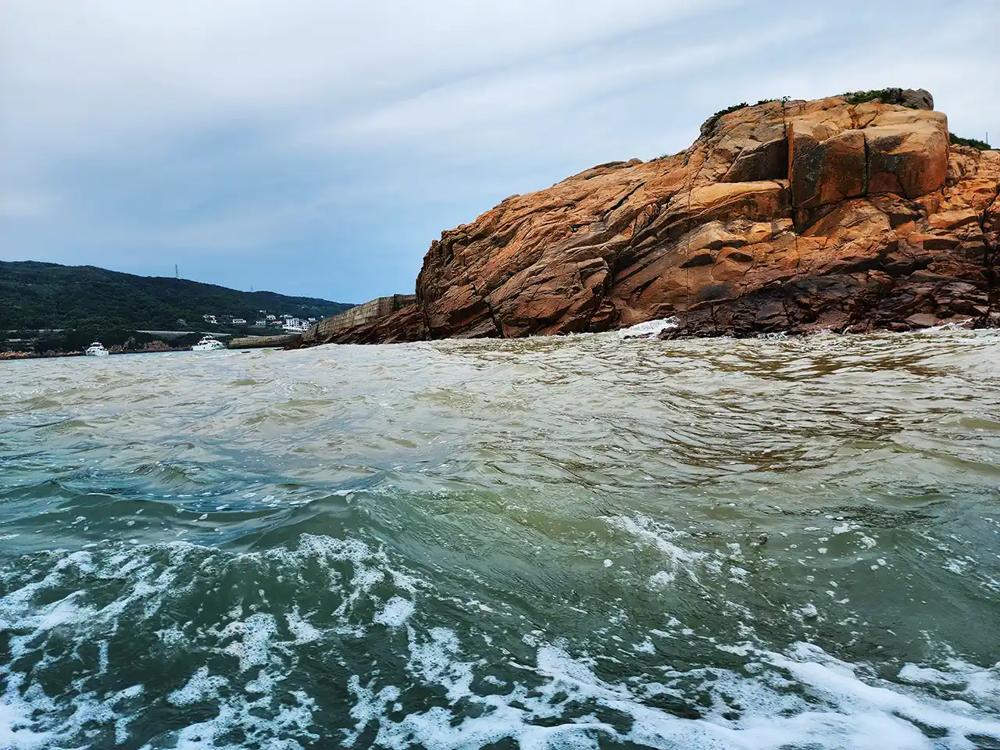
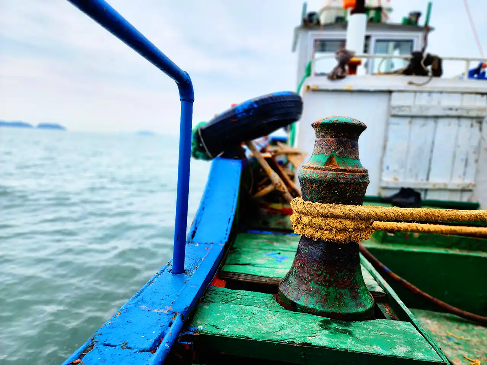
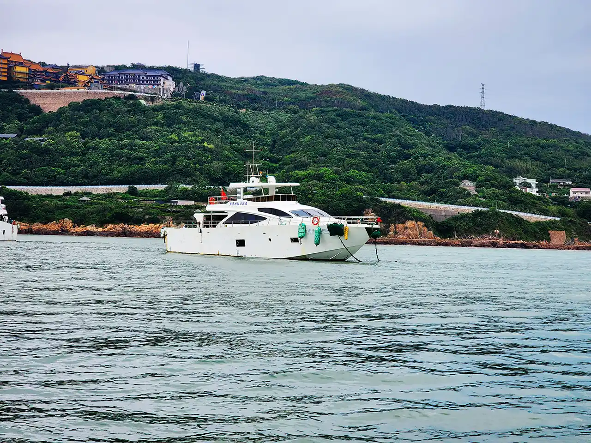
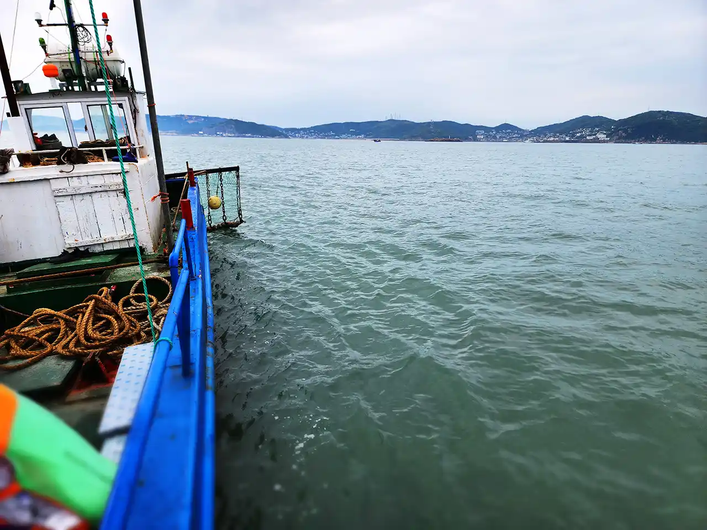
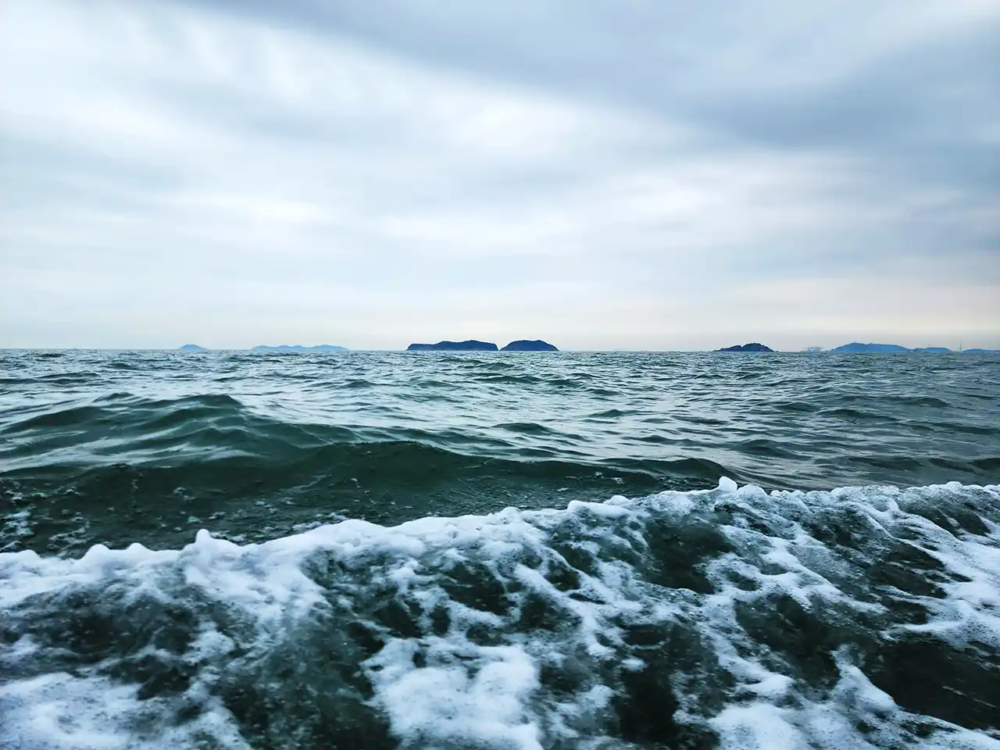

清晨，风和日丽，去海岛玩。

## 前往

路途并不算近，一路驱车，高速上车不是很多，听着歌，很快便来到了跨海大桥。

海边有很多风车，转动着巨大的风叶，创造清洁能源的同时，也给路途风景带来了一些活力。这些风车其实举例很远，但很高大，设计简洁，点缀于原本空旷的海天之间，非常容易映入眼帘，似乎在向你招手。这座桥非常长，还又限速，两边景物变化不大，很快就给人感觉进入了慢节奏的生活，有一点不适应。桥上散布着许多卡车，运送着货物。路面最右侧是一条自动驾驶限时专用车道，用黄色虚线分割开。

途径货运码头，全是集装箱，尺寸划一，多款颜色随机分布，堆成一座整齐的山，沿着道路蔓延开来，也是一番景象。随后，到客运码头了，停车场是露天的，石子路面，整体可谓非常草率。里面停了无数辆车，我可能是唯一一辆倒着进去正着停的，讲究，但在这种大环境下感觉特别奇怪，就像进了一部大家都背对着门站着的电梯，只有我转过了身。那不如就保留这种效果吧。

乘船出发。这海的颜色特别黄，像是冷萃。伴随着轮船的前行，两翼泛起了许多白色泡泡，看起来有一点像棉絮，在平静的浪花中不断变化着。不过开着开着，突然蓝了一些。

## 沙滩

终于登上海岛了，非常晒，先休息放松一下。

玩了一轮飞盘，天幕之下，坐在小椅子上喝上几杯小茶，吃点小吃，悠闲愉悦，看着周边的景致，世界似乎静止了下来，只剩海风，伴随着浪花白噪音，吹进每个人的内心深处，仿佛一切繁杂都是那么的遥远，眼前只留下一抹轻松的平静。

.webp)

然后驻足沙滩。细腻的海沙，在阳光之下，温热柔软。翻开沙滩上的一些石头，偶尔能看到些许迷你螃蟹，或躲或跑，很容易抓到。旁边的海浪一遍一遍地冲刷过来，容易让人看得很入神，忘记天色的变化。又是一个可以让你忘乎一切的世界。

## 海钓

乘坐着一艘非常老旧的小渔船，在大海里一路晃过去，这番感受也是挺有趣。当然，如果希望更为舒适的感觉，也有非常接地气的“坐着游艇去捕鱼”的服务。

船在海中开了许久，欣赏着无边无际的大海，差一点忘了是来海钓的。

海浪不大，渔船依旧颠簸。开始撒网，不一会儿就捞上一篮还没进炉的海鲜。放走一些小的，剩下的可以直接带去餐厅。在这捕鱼其实更侧重的是一个过程的享受：游弋在大海之中，随着波浪起伏，离岸边越来越远，愈发觉得这个世界的宏大，天地间沧海一粟，能包容这一切的，只有自己强大后的智慧与胆略。

浪花附着于海水之上舞动，深处的鱼儿可能并不知道海面之上的世界，就像我们也有许多未曾了解，但这更会鼓动我们继续向前深入探索。
