香格里拉（ཞེས་པར་གཙང་པོ / Shangri-la）是“心中的日月”之意，这里宛如世外桃源，自然条件优秀，人文环境和谐，整体非常安宁，是个适合心灵洗礼的圣地。

## 清晨冥修

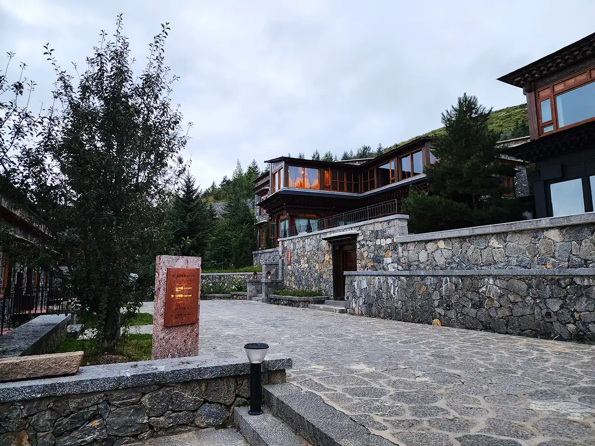

天空微亮，太阳尚在山背后，阳光来自空气反射，大清早赶去体验藏族的瑜伽冥修，感受空灵，洗涤心灵。

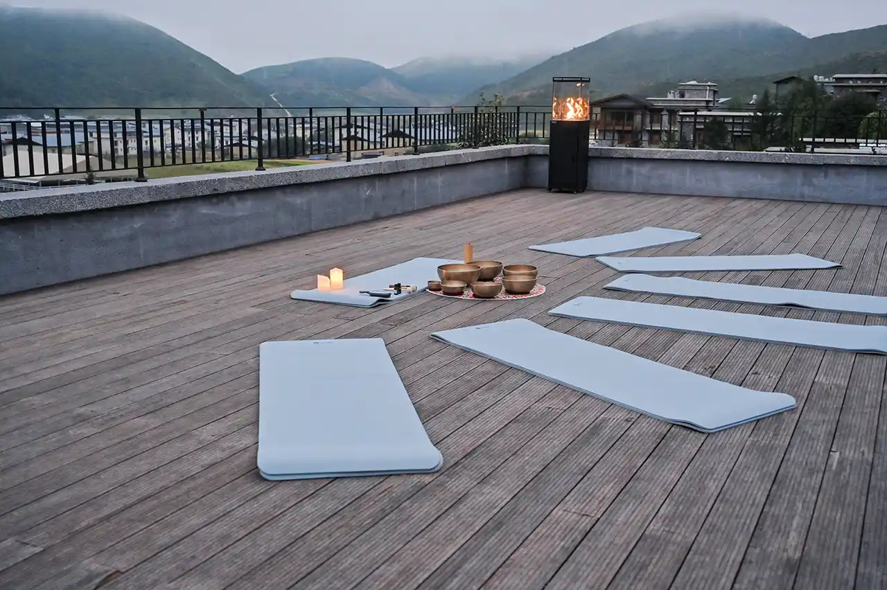

天台上，瑜伽垫和相关物品已准备就绪。穿着藏袍的老师介绍着肢体动作和心灵意念，在舒缓的背景音乐下，大家跟随做着动作，去感受身边的气息和自己的脉动，控制呼吸，去放松肌肉和保持专注力，将杂念摒弃，全神贯注投入到冥修过程当中。

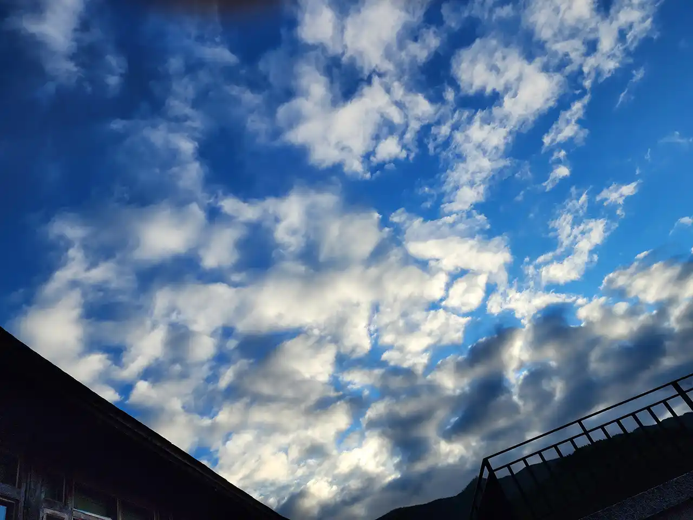

大多数时候都是闭着眼，但当有次睁开眼发现天空已变亮了许多时，还是被震惊到。可能因为这是少有的内心放松，顿时觉得周围都是那么光彩夺目却又清新典雅，所以很容易被触动。

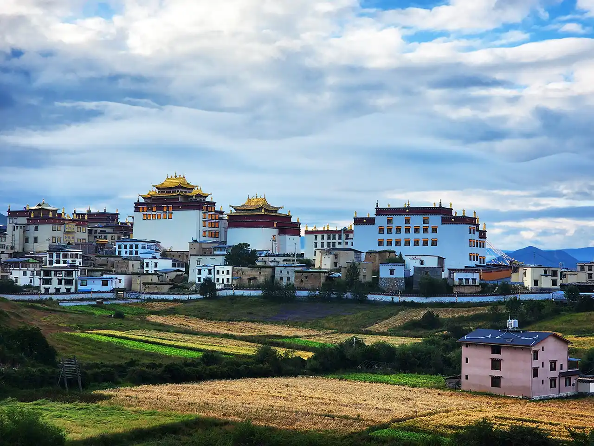

经过一个小时的冥修，太阳已经翻越了远处的高山，照在大地上，不远处的松赞林寺的金顶非常耀眼，下方的青稞田也是泛着金光，一切都是这么的美好。

## 塔中塔

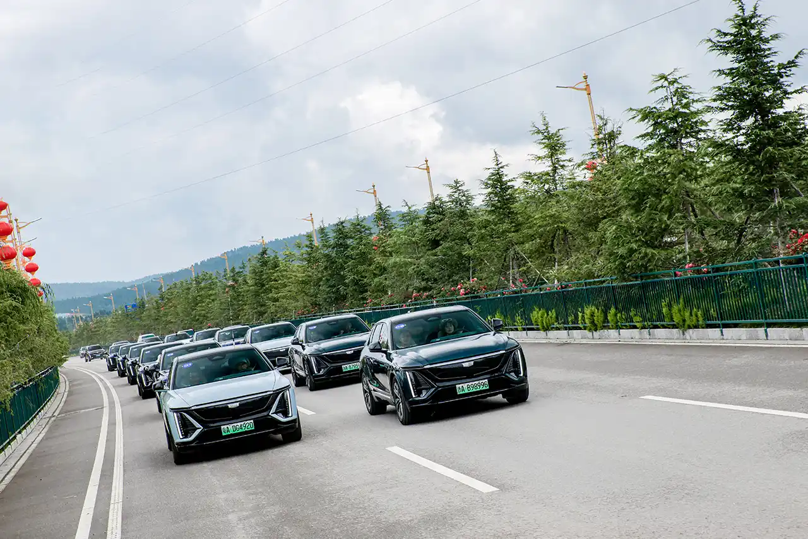

吃过早饭后，凯迪拉克 Lyriq 自驾车队再度编队前行，开往下一个目的地——和谐塔中塔。这是世界上最大的藏传佛教白塔。

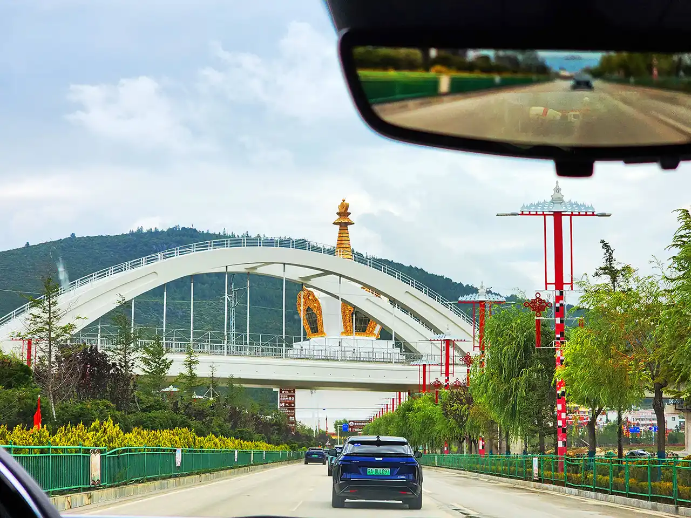

和谐塔中塔规模宏大，其不光是香格里拉的一大景点，更是当地人在各种重要时节所会前往的地方，例如结婚。

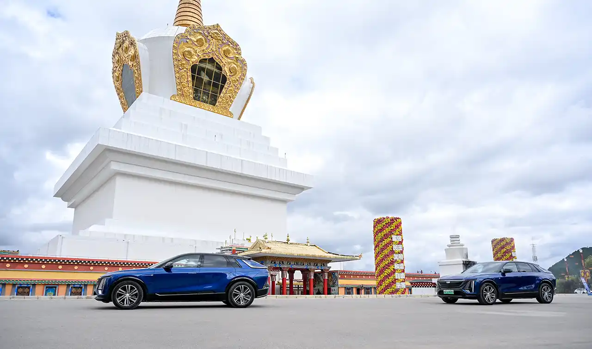

和一般的环形路口不一样，当从外面开入塔中塔区域后，需要顺时针开车绕塔旋转，通常需要9圈，保持虔诚。

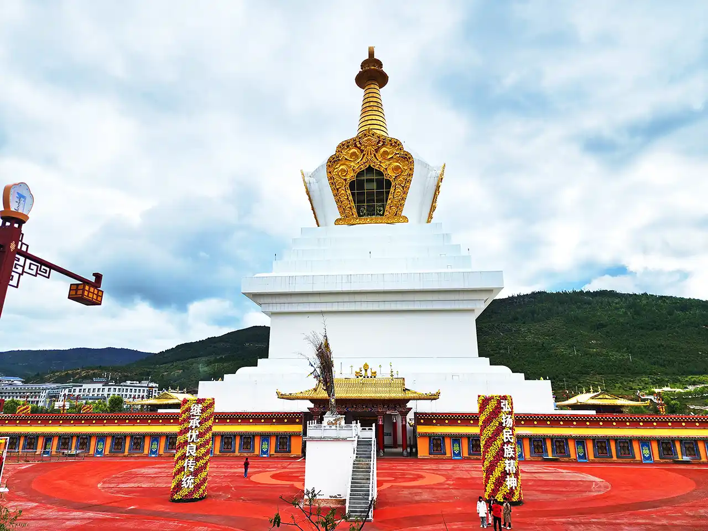

顾名思义，塔外有塔，塔在塔中。该塔在原平安吉祥塔之基础上进行扩建，外观仿原塔模样。塔身白色，顶部金光闪闪，底部建筑红黄相间。

## 篝火晚会

晚宴是西式模式，但菜品本质还是基于藏式菜肴烹饪，逐道呈上，味道非常棒，红酒依然是产区特挑，现场也有歌舞助兴。

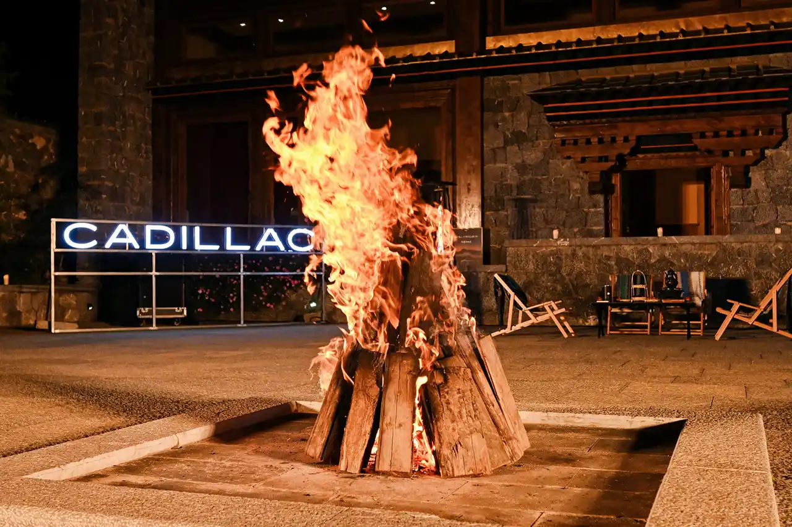

餐厅外，篝火已点燃，四周也竖起探照灯和长火条，围着一圈是沙滩椅，和摆了茶水和零食的小茶几，氛围感浓浓。

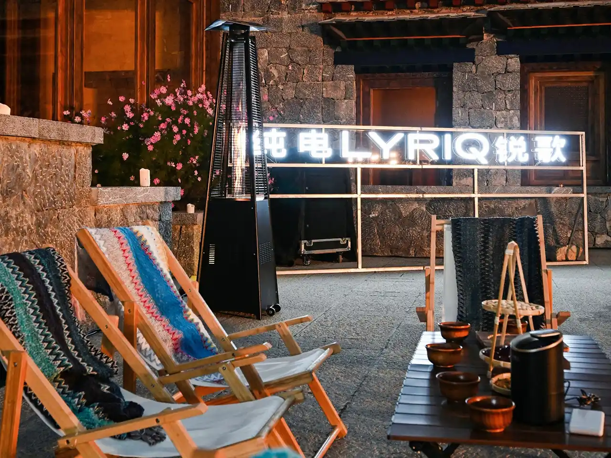

从餐厅中走了出来，来到篝火旁，先是坐下，夜晚的阴凉，在团团火焰附近，变得非常温暖。

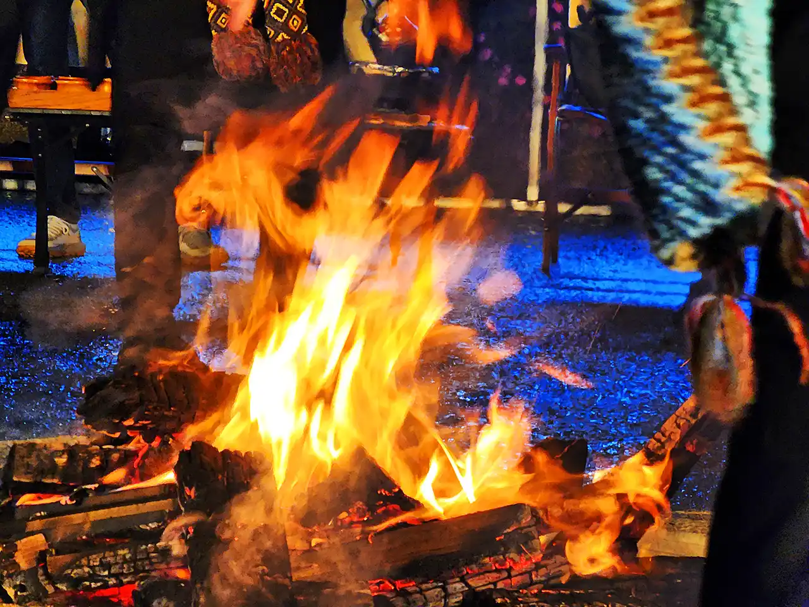

藏族舞者围了上来，在欢快的民族歌曲中欢快地跳跃了起来，并将大家也拉入其中，一并载歌载舞围着转跳。

心中的日月，传说中的人间天堂。
