今天从丽江前往香格里拉，去感受了解这桃园般的存在。

## 一路前行

吃完早饭，收拾行李，就随凯迪拉克 Lyriq 自驾车队出发了。

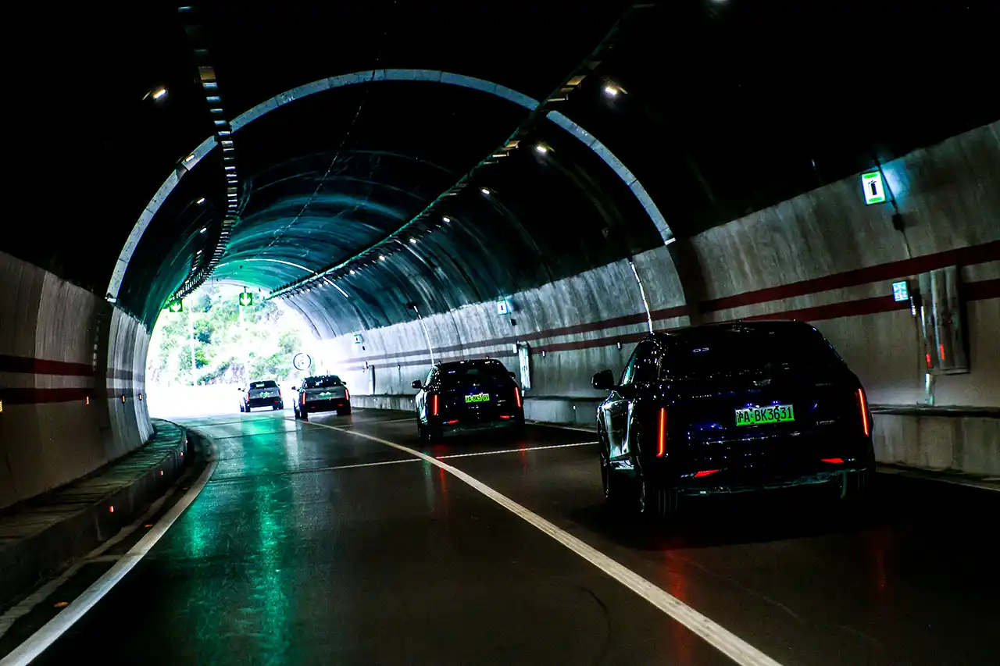

一路上并没有山路，隧道不多但长，一路上广播介绍 Lyriq 的一系列特性，让我们进行充分感受，浩浩荡荡十多辆一样的车时刻组成队形还是很壮观的。

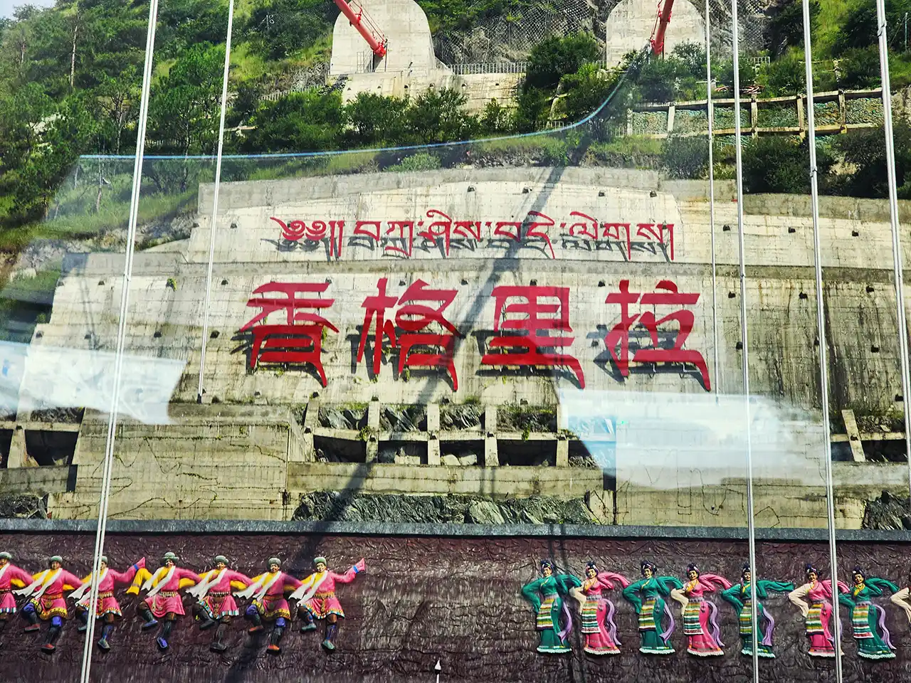

不一会儿，就驶入香格里拉的地界了。香格里拉（Shangri-la）是“心中的日月”的意思，这个名字出名于詹姆斯·希尔顿于20世纪30年代所著小说《消失的地平线》，该市原本为中甸县，2001年才改为现名，并于2014年设为县级市，依旧属云南省迪庆藏族自治州。

​中午在香巴拉老街体验藏民饮食，非常可口。

## 小布达拉宫

林木深幽现清泉，天降金鹜嬉其间。噶丹·松赞林（དགའ་ལྡན་སུམ་རྩེན་གླིང / Dga' ldan Sum rtsen gling / 归化）寺，是云南省规模最大的藏传佛教寺院，于1679年依山而建，威严华美，被誉为小布达拉宫。

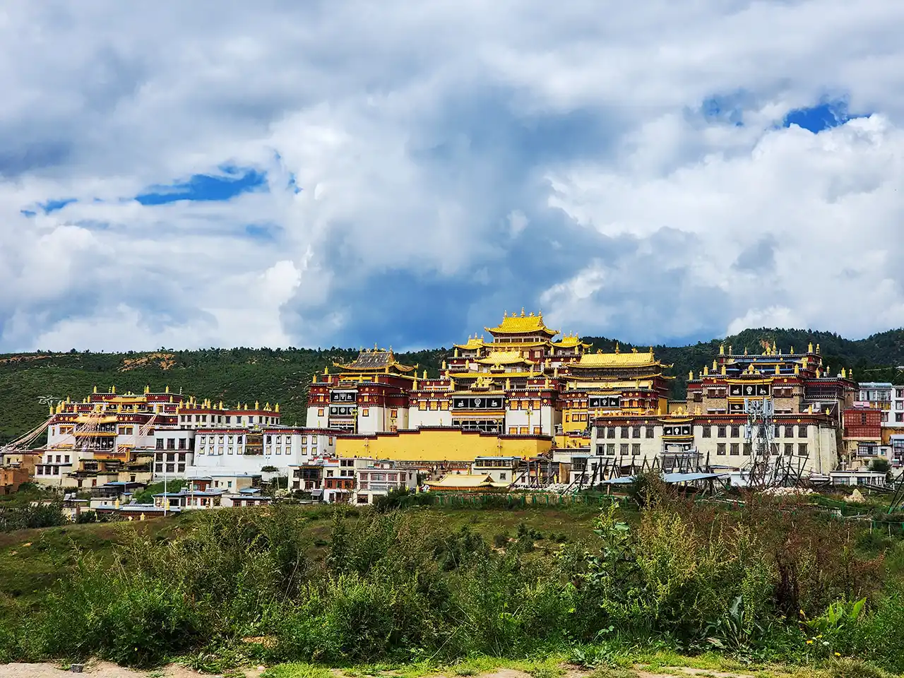

松赞林寺金碧辉煌，远看气势磅礴，外形犹如一座古堡，其名由五世达赖喇嘛亲赐。

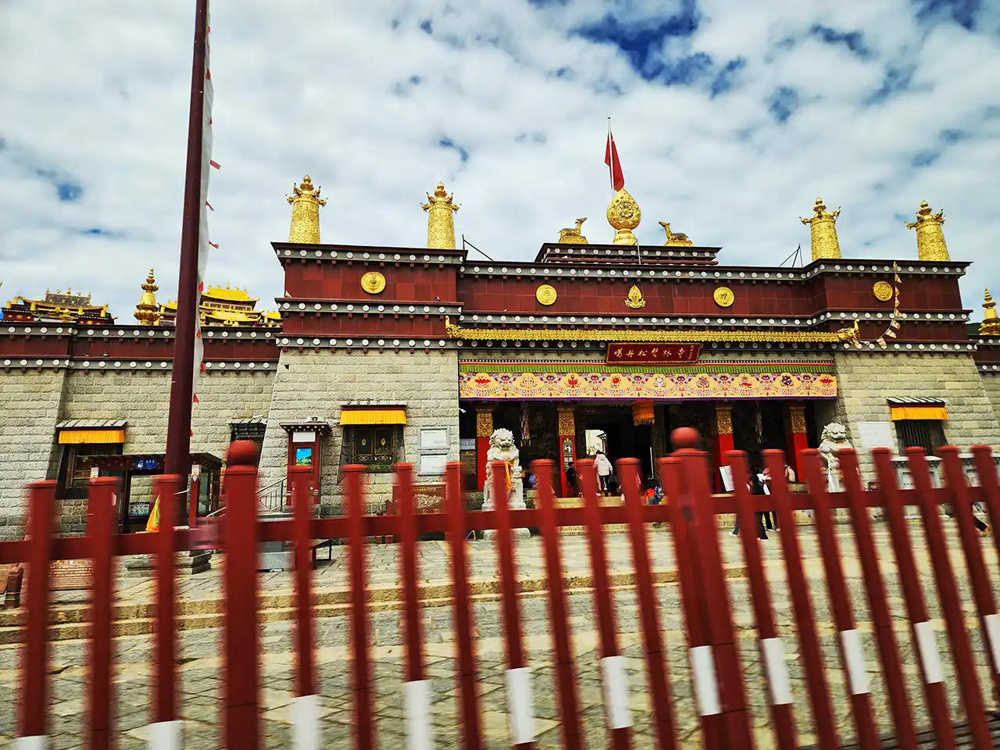

藏语中，颂赞一词即指天界三神，林则是寺的意思。其整体由古建筑群构成，建筑大多为石制，上部为红色，屋顶金光闪闪。

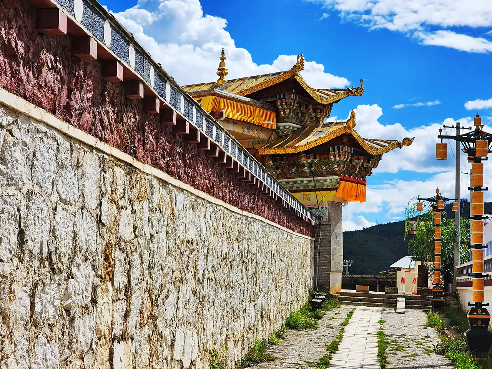

寺院外围筑有椭圆形城垣，非常有质感，趴在墙边拍照也是很美。

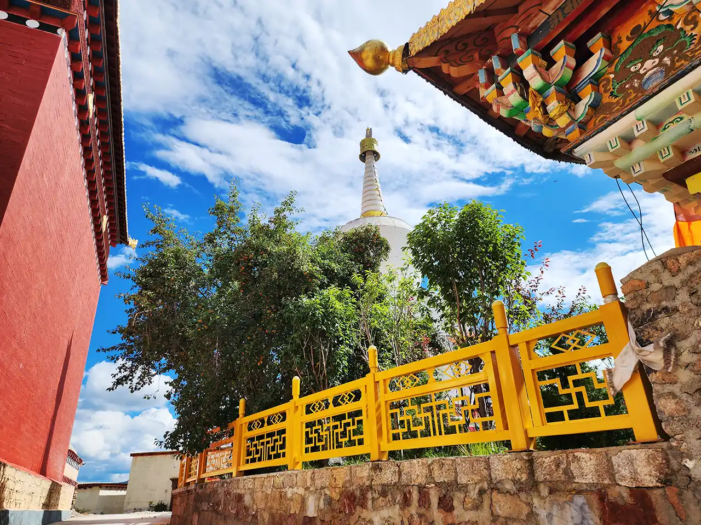

边上屹立一座白塔。

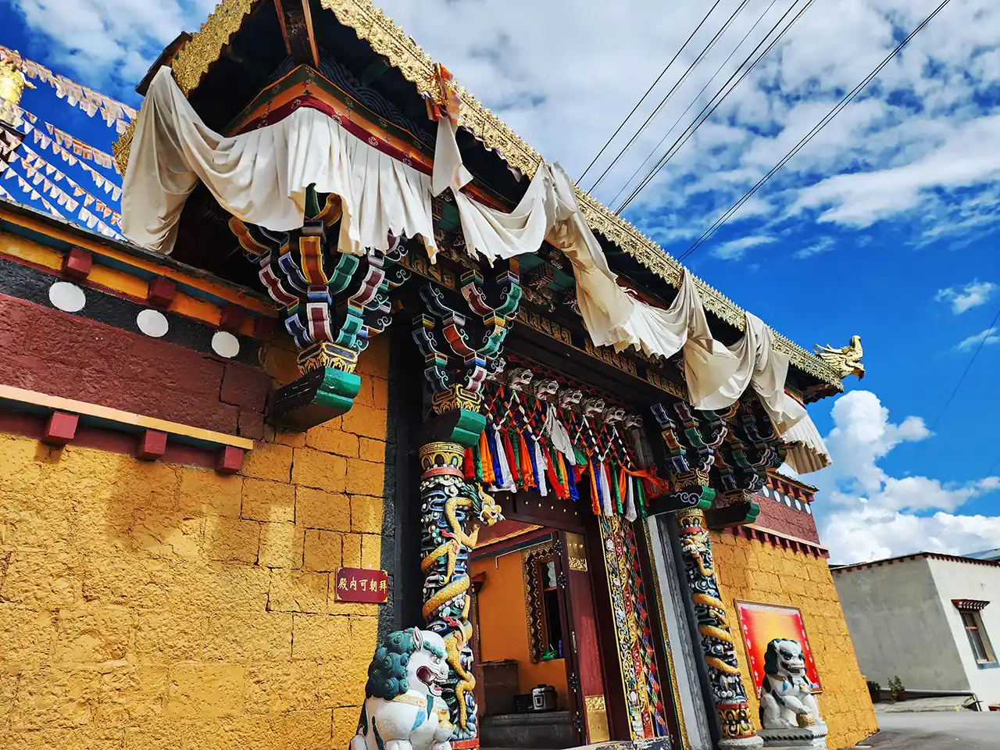

其内含有多座寺庙建筑。

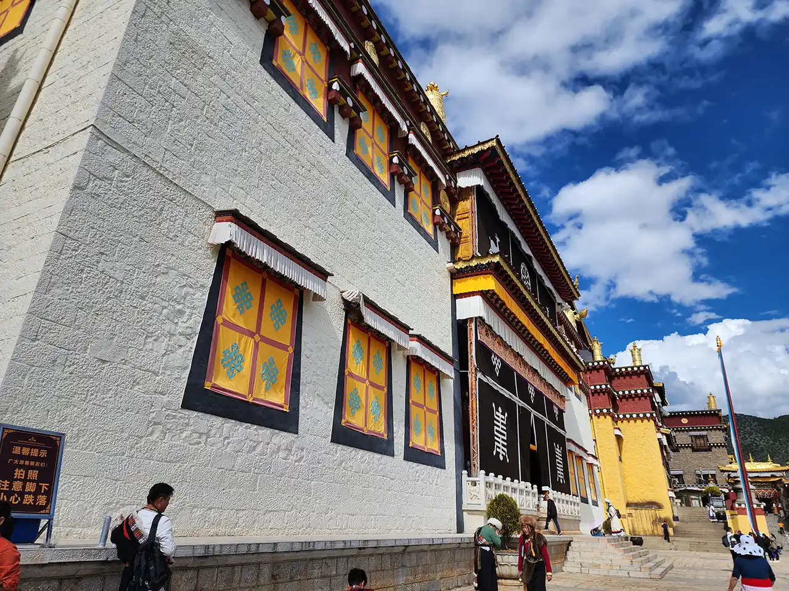

主建筑扎仓，即僧院，是学习经典和修研教义的地方，期内有大量壁画和雕塑。

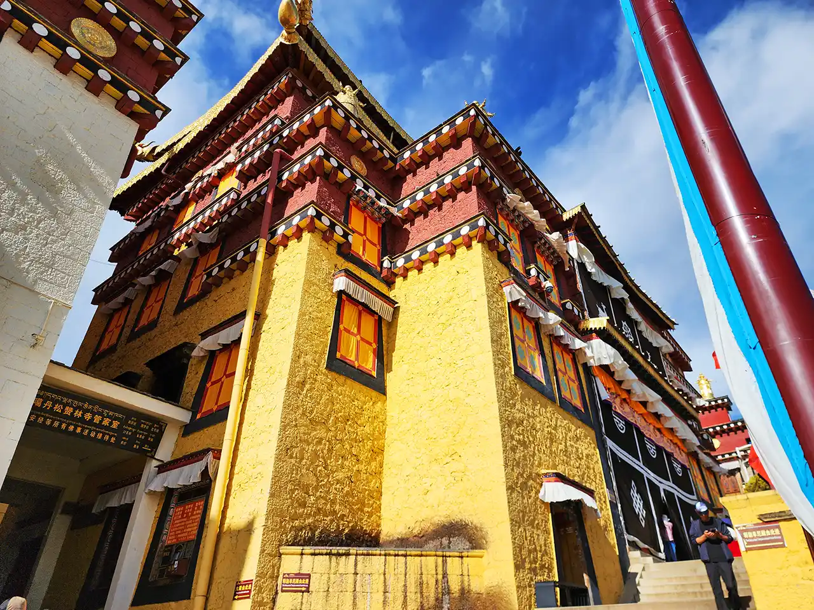

旁边即为佛院。

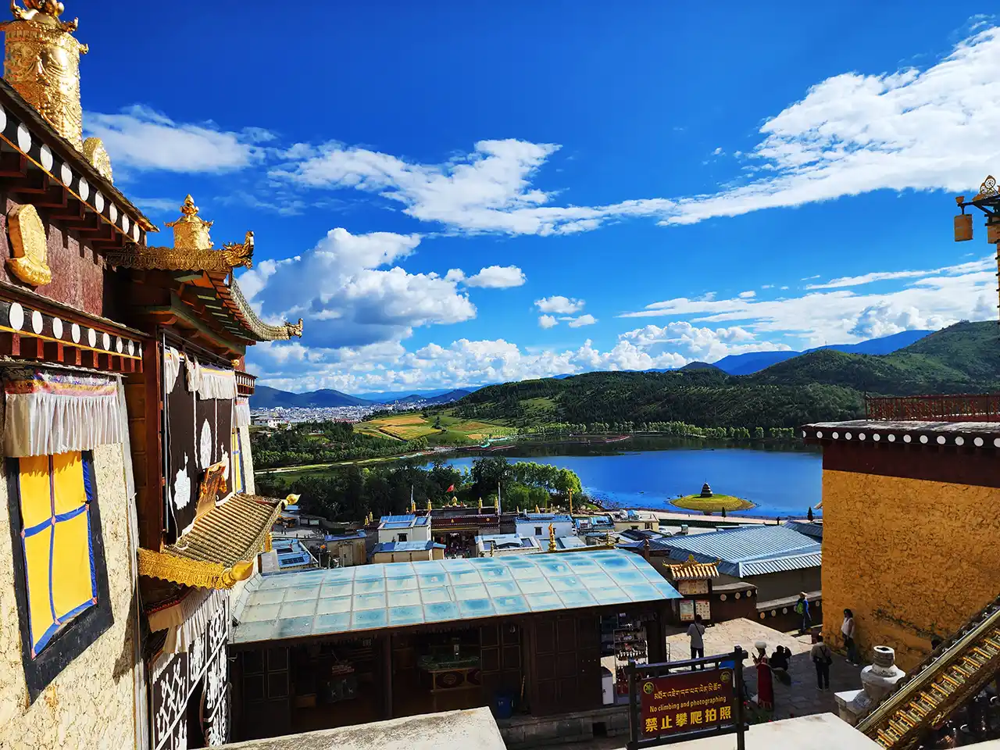

从此处下去，便可去敲钟，需顺时步行转动针奇数圈，大钟旋转时顶部一长棍便会敲打作响。

彩云之南的天空：蔚蓝，飘着白云，一切都是那么的舒适。不过由于海拔较高，需要注意防晒。

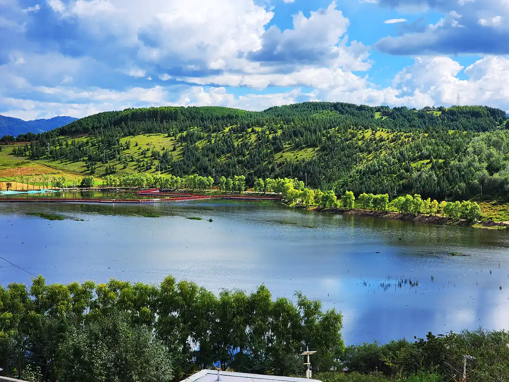

拉姆央措湖，藏语意为圣母灵魂湖，可从松赞林寺直接俯瞰全景。湖光清澈，对面的树林草地郁郁葱葱。

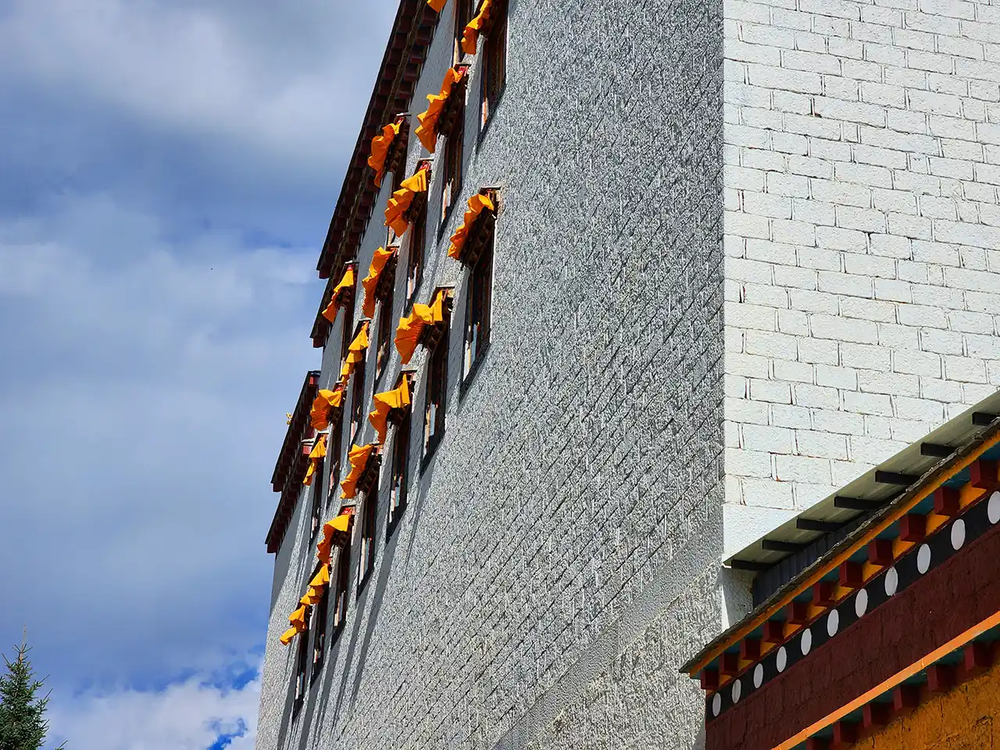

松赞林寺很大，需要一段时间来光顾。有位藏族小哥一路细心讲解，收获颇多。下午时光很快就过去了。

## 林卡

时间不早了，入住酒店。

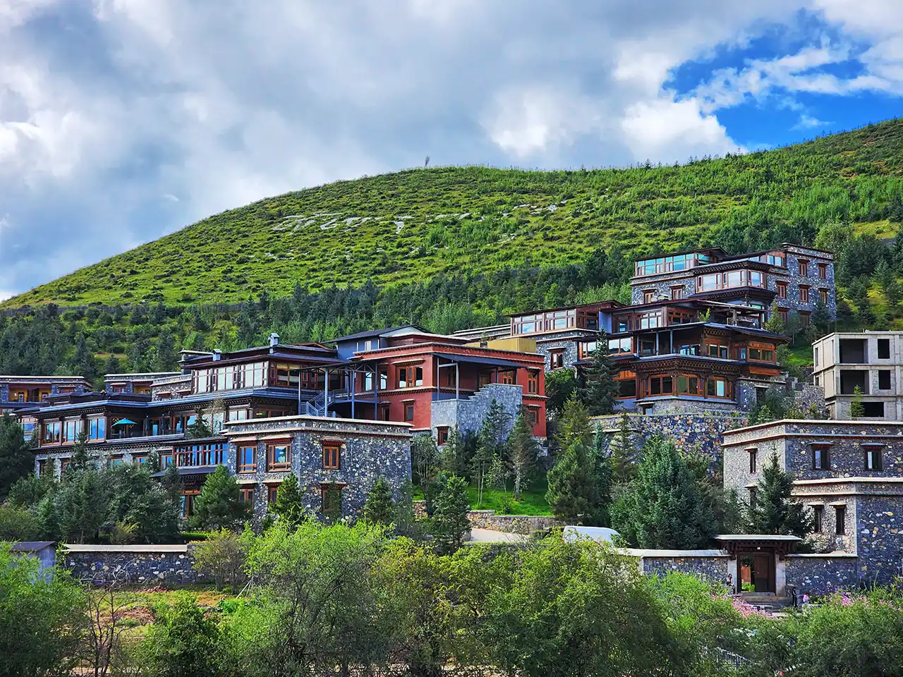

入住的酒店有如一个别样风情的小镇，其间建筑物错落有致布置在山腰。房间设计古朴典雅，站在阳台远眺便可看到松赞林寺和马场。

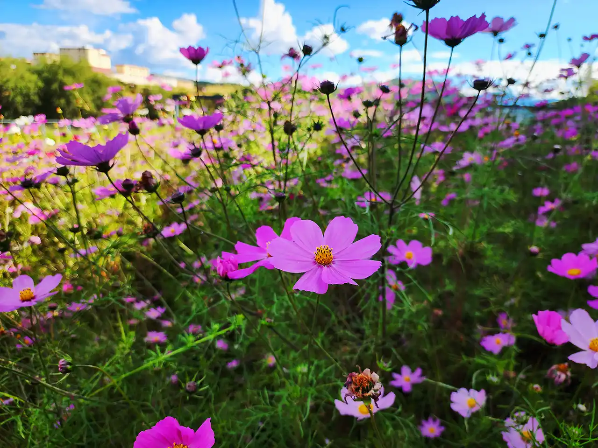

其也拥有大量植被包裹，非常宁静，有如在花园里一般。花园一词，藏语里音译过来即为林卡。

入夜，丰盛的晚餐时间，趁着蘑菇季节的尾巴，当季松茸刺身盘、芝士焗乳饼虎掌菌、特色牛肝菌黄焖鸡……山珍美食，不亦乐乎。
