收到凯迪拉克的邀请函，参加其赞助的中欧国际工商学院（CEIBS）举办的「中欧话未来」系列活动之《欧洲视角下的地缘政治和多级外交》，感受人类在面临次贷危机、新冠疫情和现代战火等多重灾难交织下，是如何运用智慧达成共识，积极进步并推动和平外交。

## 入场

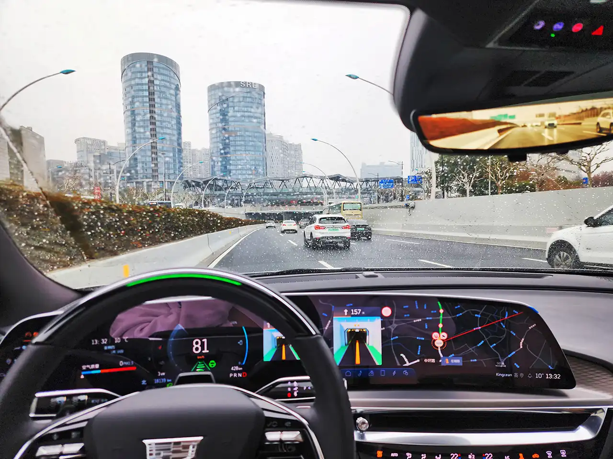

天公不作美，阴雨中前行，驱车沿着中环一路开往中欧国际工商学院（上海校区），好在路上较为通畅，很快便到达目的地，聘邀请函进入校园。

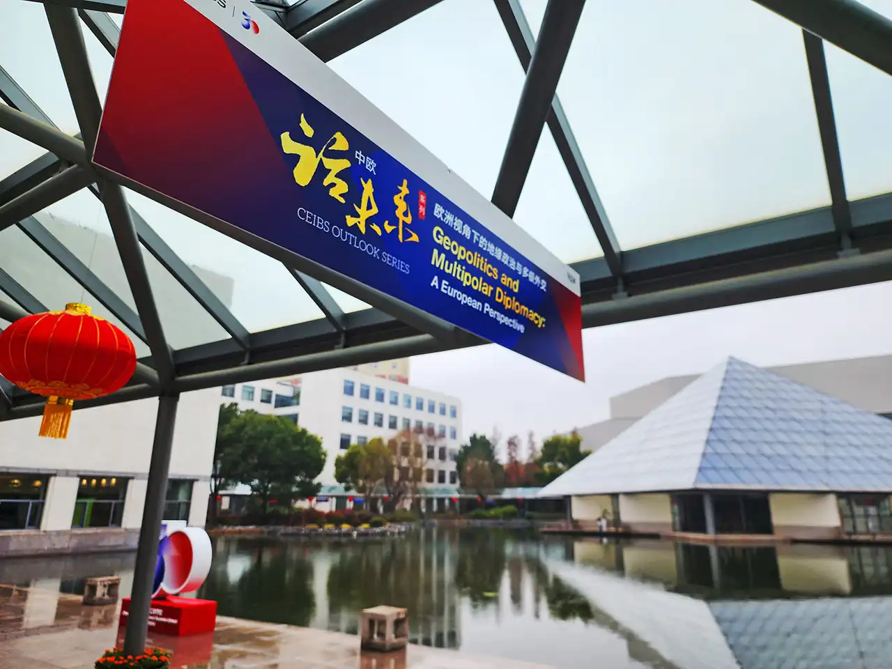

进入校园内，贝聿铭·柯布·弗里德建筑师事务所（P.C.F.）设计风格非常具有可识别性，白墙黛瓦，标志性的中欧金字塔映入眼帘，流水行廊顶部挂着本次活动的宣传海报横幅。

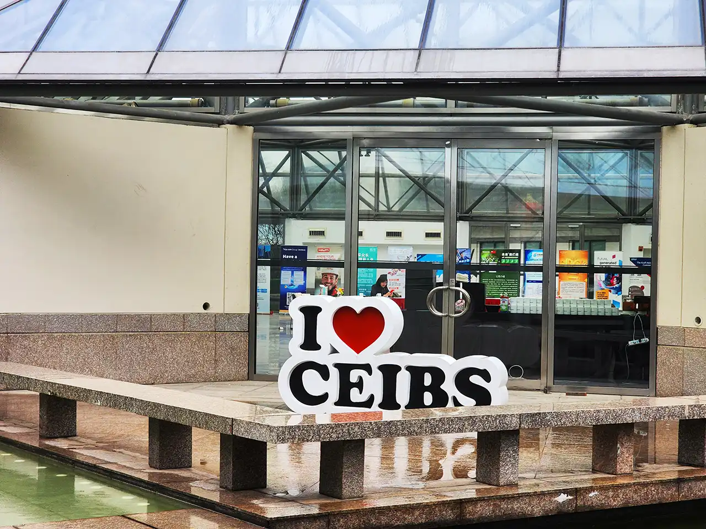

大量玻璃的运用，尤其在雨中更显得光彩四溢，几何设计外形颇具现代感，但其中又不乏活泼鲜艳的点缀，又重新让人置身回轻松中。

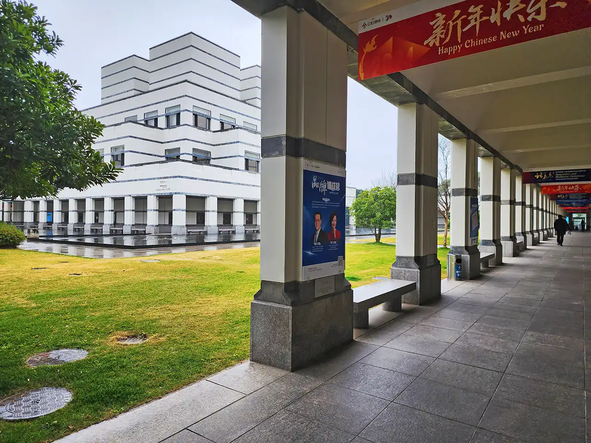

在校园中漫步，感受着四周的清净。平整的青翠草坪，复杂而又简约的建筑坐落其中，四周的水池给整体氛围增添活力。

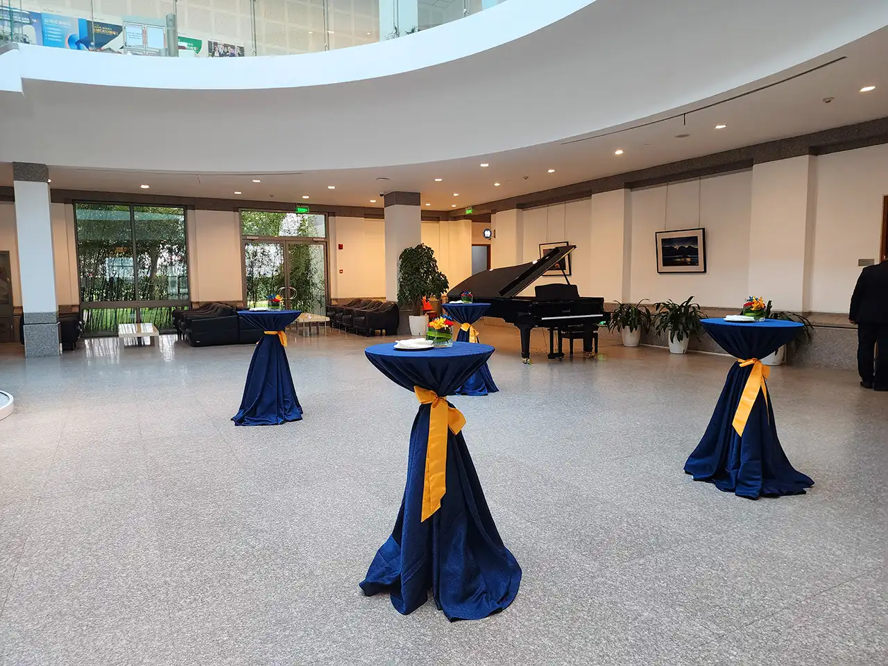

学校中有许多交流区，圆形高桌可用于放置甜点饮品，方便大家分组小范围聚在一起进行话题探讨，特有一种文化模式。

## 活动

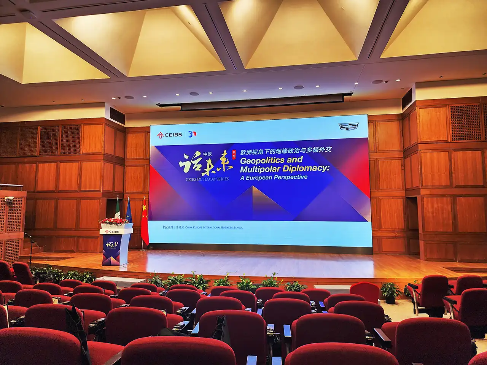

论坛马上就要开始了，入场就座。此次正好在中欧三十周年校庆来临之际，以欧洲视角来洞察各国在复杂的地缘政治格局中所面临的各种挑战与机遇，并审视这个过程中如何运用多维度、多层次的外交手段尝试将各类问题进行解决。

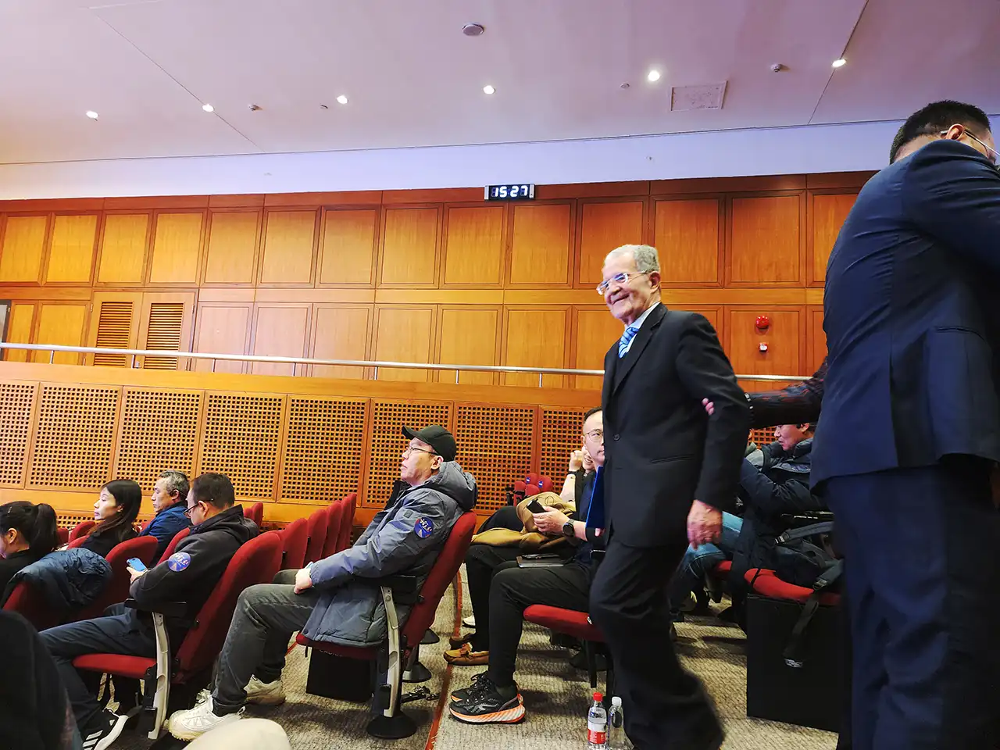

本次的主旨演讲嘉宾是前意大利总理、欧洲委员会主席罗马诺·普罗迪（Romano Prodi）教授，随着一阵掌声进入会场。一同前来的还有各国使节，以及法拉利公司的高层。大家入座后，便正式开始，先是主持人中欧副院长兼教务长、管理学与领导力教授濮方可（Frank Bournois）发表欢迎致辞。

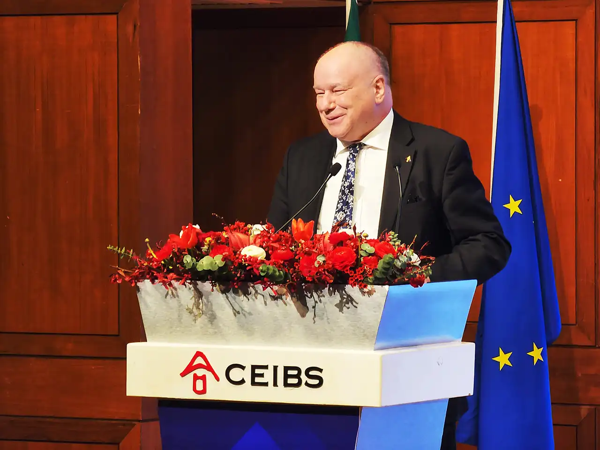

随后，中欧院长（欧方）兼市场营销学教授杜道明（Dominique V. Turpin）也发表了欢迎致辞。

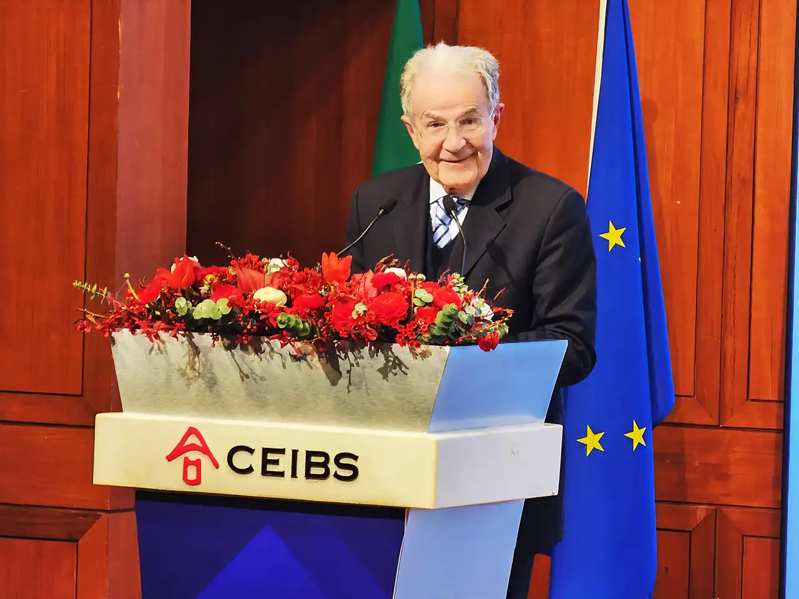

之后便是普罗迪教授的主旨演讲了，娓娓道来其观点，从各种角度探讨了世界各地的背景不同，并以此树立起公正包容的世界观和治理体系方向。以下陈列为其演讲中部分观点整理（理解不一定准确且不代表本人观点）。

- 虽然其对西方普世某关键词持非常支持，但认为不适宜盲目推广，如同交通规则的树立，只需遵守规则本身，而不需要每个人都有对应的该观点来支撑。
- 中国 19% 的人口只有 7% 的耕地，与美国自己自足甚至还有出口不同，因此更需建立长线合作关系，并与非洲和拉美的农产品出口策略相结合，根据不同国家的实际情况和文化背景建立不同的外交模式。
- 中国习惯与欧洲各国单独会谈沟通，而不是与欧盟整体，但西方并非与世界为敌，欧洲更多是起到调解的作用，即便在历史上也是如此。但中国也有对欧盟直接进行交流支持，例如欧元发行时中国便很快将其加入外汇体系中。
- 世界各国在宏观方向上都有不同的情况，美国总统竞选会对政治和方向产生显著变化，欧洲内部不同国家也有不同的模式，而欧盟本身则又需要将这些进行融合。相对来说，中美都有较为强势的政策，而欧洲并没有，各国的政策都是分开的，例如新能源和传统行业的补贴，各国都有各自的独立政策。
- 许多时候还是需要世界各国一并推进一致性的规则，例如对 AI 的监管。但考虑到这个世界各个国家发达程度的不一样，有时对一些策略的指定需要考虑更多的场景，例如碳排放，如果对印度在其完成行业转型前也执行严格标准则不合时宜。
- 各国依旧处于竞争关系，国际贸易虽还在但其实已没那么重要，现在主要应当推动内循环，这其中各项环境变化很大，新的贸易方向则需要由政府来主导。而关于公平竞争，任重而道远，需要一步一步考虑。
- 欧洲实际上是世界第二经济体，拥有最大的出口量，也是唯一的调节机制。但事实上，一些科技公司市值甚至超越一些欧洲国家的 GDP，中美许多公司都有巨大影响力，这让欧洲各国更应该聚在一起，欧洲以前也有许多成功经历，曾经敌对的国家现在也有缔约，欧盟从6个国家到28个国家再到27个国家，其中一些国家有不同意见但最终都仍在一起，还有更多国家想加入，目前这个发展的道路只走了一半。
- 金融危机是由美国造成的，但其只花了一年多的时间便走出去了，因为美国拥有单一的政策，而欧洲不是，各国不尽相同，因此首次阴影影响了很久，随后的新冠也是如此，其统一的政策制定了很久。欧洲委员会中各国均有一票否决，导致许多事情无法推进，需要改革为多数票通过模式，尤其是在统一外交方面更显得举步维艰，但好在这一切都在进步中。

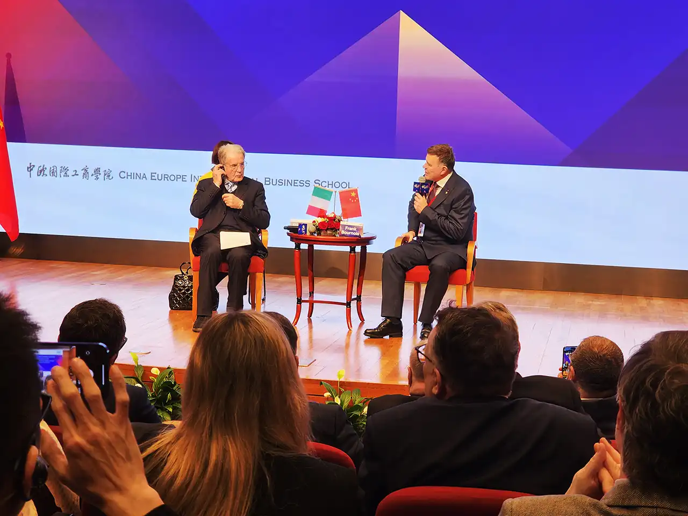

接下来是对话时间，由主持人濮方可教授和观众分别进行提问，普罗迪教授进行解答，其中也不乏一些像俄乌冲突之类的尖锐问题。

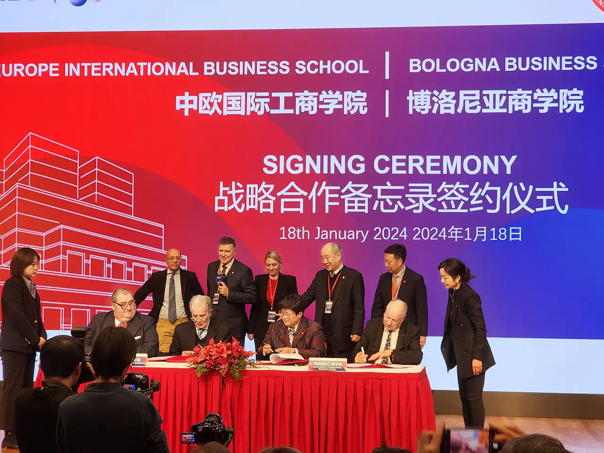

活动临近结束时，中欧院长汪泓教授上台赠礼，后面还有个与博洛尼亚商学院的战略合作备忘录签约仪式。

## 宴会

走出演讲厅，甜点饮料早已准备好，品尝少许，便去参加后续的鸡尾酒交流会。

拿了些北京烤鸭、啤酒炸鸡、小蛋糕、迷你汉堡、鸡尾酒等，一位在读 MBA 同学邀请我加入她一桌。

夜色下的校园也别有一番景象，金字塔在湖中泛着金光，连同投影和远处的高楼一并呈现出祥和而活力的美景，在这短暂的文化交流中，预示着美好的明日光辉。
