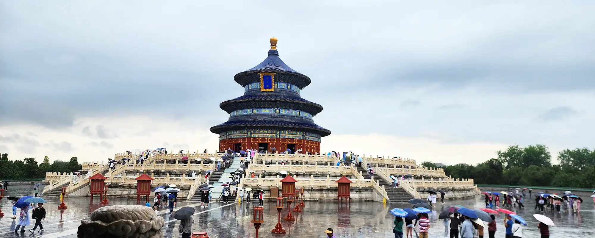
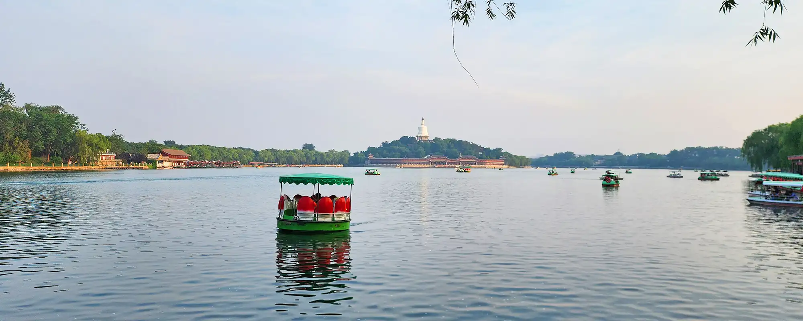
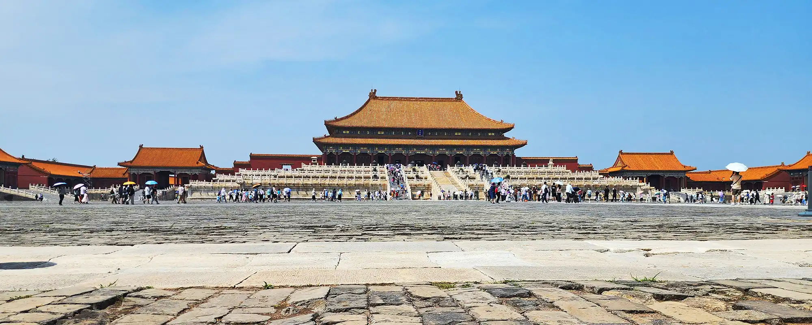

1. __[天坛](./heaven)__ _（2024年6月7日）_

   

   上次来天坛已是数年前，且行程匆忙点到为止；再上次则是小时候了，映象已不是那么深刻。这次特地选择故地重游，再次感受庄严和宁静，以及那份厚重的文化底蕴。恰逢下雨天，这是不是预示着接下来风调雨顺大丰收呢？自当无阻前行，也算悠然自得。

2. __[从什刹海到北海](./seas)__ _（2024年6月9日）_

   

   在北京 city walk，夏日骄阳之下还是有点困难的，只能沿着有水的附近行走，沿着中轴线从北往南，穿过什刹海，抵达北海，再往西，沿途一路人文风景和历史回忆，在自然环境中尽显出不一样的帝都感觉。

3. __[紫禁城](./forbidden)__ _（2024年6月10日）_

   

   又又来到紫禁城，三十多度高温漫步欣赏数小时，就为观光天子威仪气魄。
