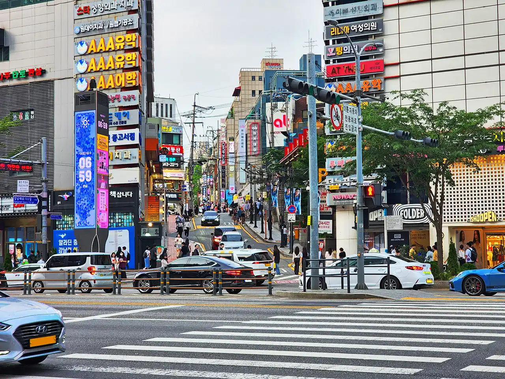

一大早飞往韩国，在仁川（인천）登陆，乘 MPV 包车沿高速一路飞驰，前往首尔（서울）。原本打算年初前来，不料当时出现当地政坛风波，导致一拖再拖，在盛夏到来前总算前来，感受这随着时代不停发展的古都的魅力。

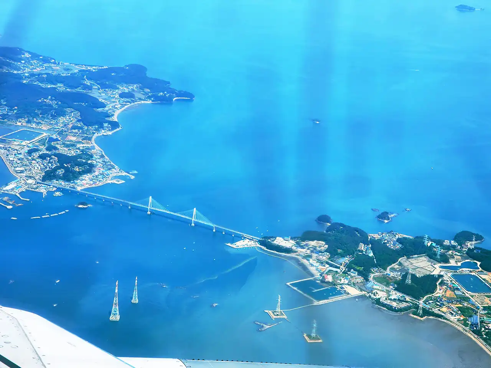

还在飞机上时，便隔着舷窗俯视看到美丽的海景，有如蓝色丝绸上点缀着许多白色线条和绿色色块，非常好看。

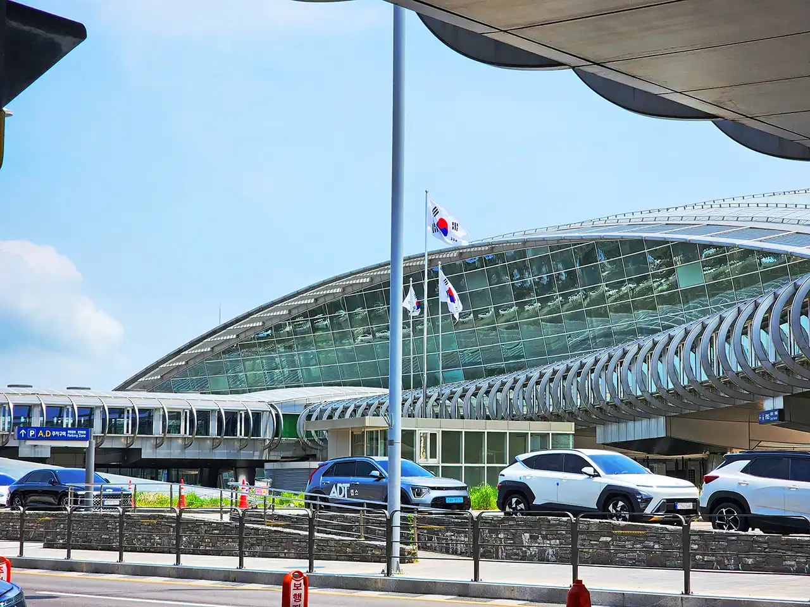

走出机场，艳阳高照，直奔市区。

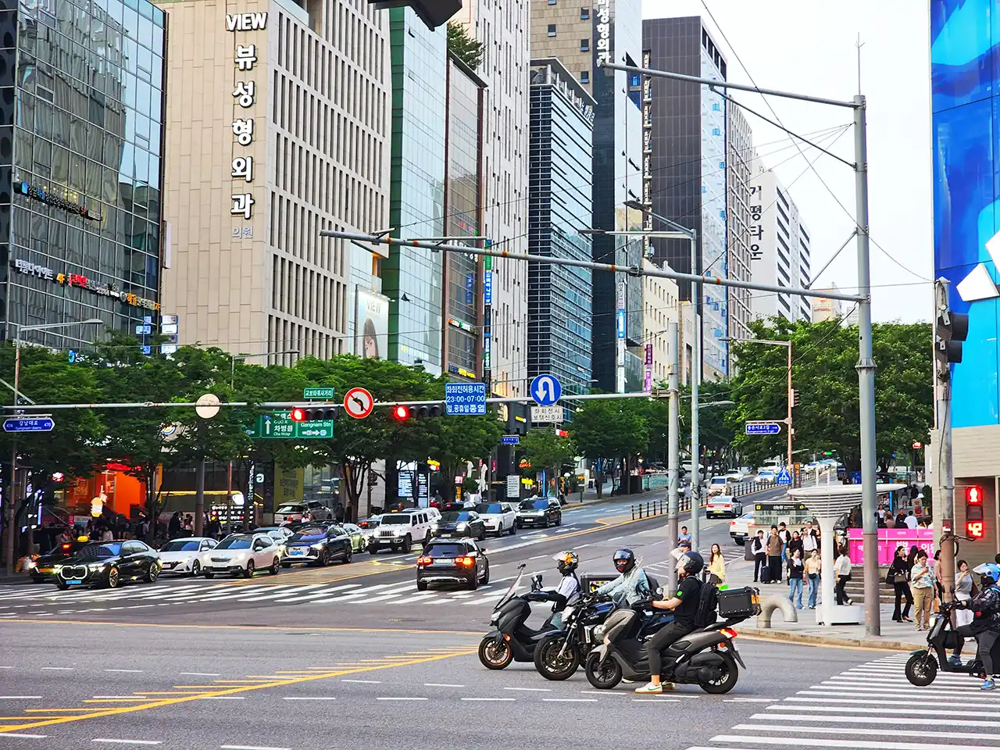

这几天主要是在最繁华的江南区，位于汉江（한강）以南，高楼林立，有许多地方存在一些斜坡，看起来也是很有趣。

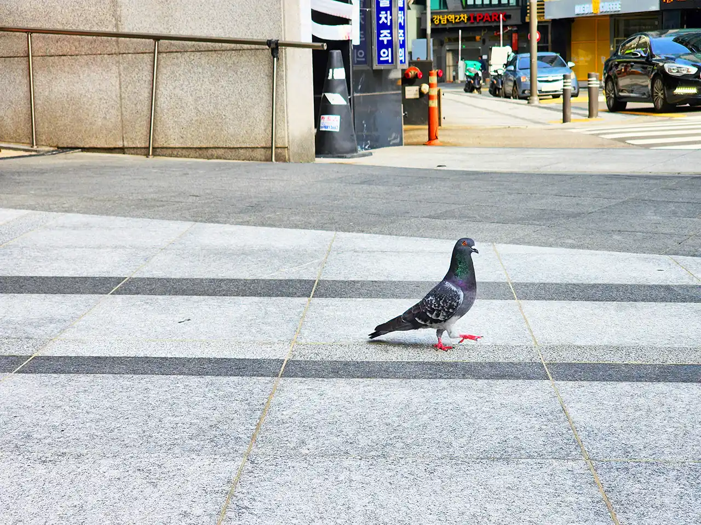

在城市中也偶尔能遇到鸽子，并非公园圈养那种，在路上走来走去，并不怕人，当然，如果靠得太近或是在附近追赶，那么它还是会被吓飞的。

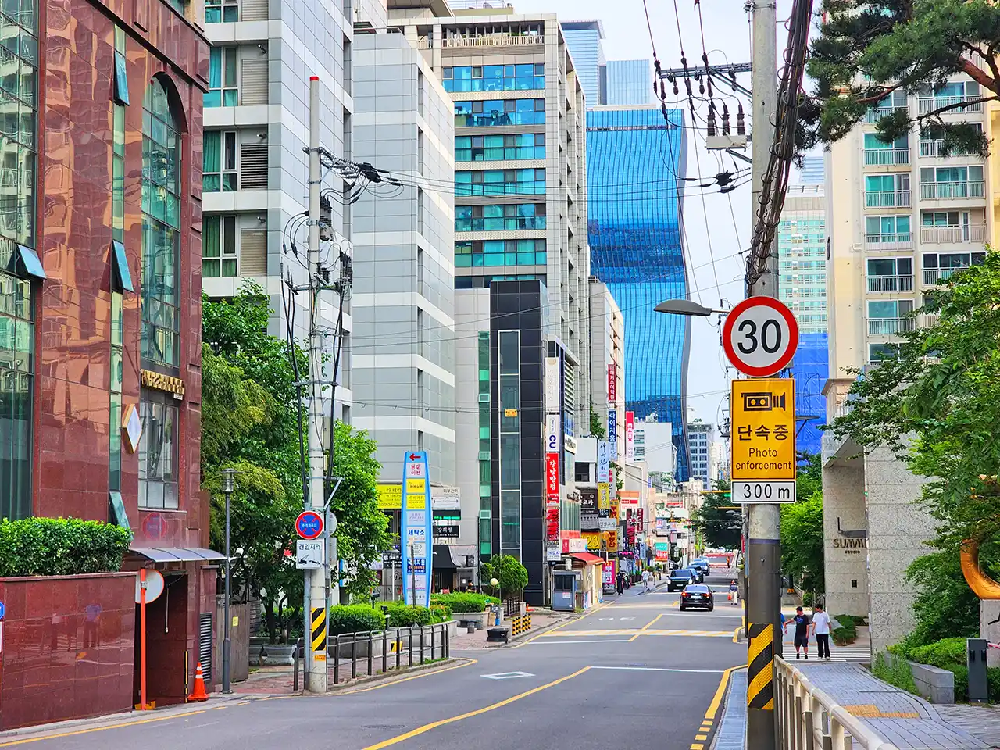

可以看到，这里的建筑物造型各异，有一些还是很有设计感的。但马路行的电线杆也是随处可见，新旧情况混杂。可能因为尚处工作日关系，道路上车辆尚且不是很多，如此 citywalk 还是非常惬意的。

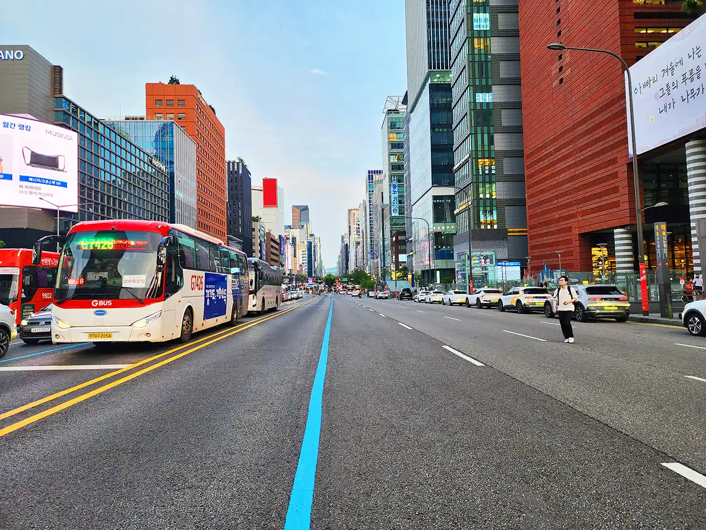

路边建筑物的颜色还是很丰富的，并非单调的灰色或蓝色，不是那么单调，给城市带来活力，这一点还是非常不错的。城市非常干净，道路划线也非常清晰。

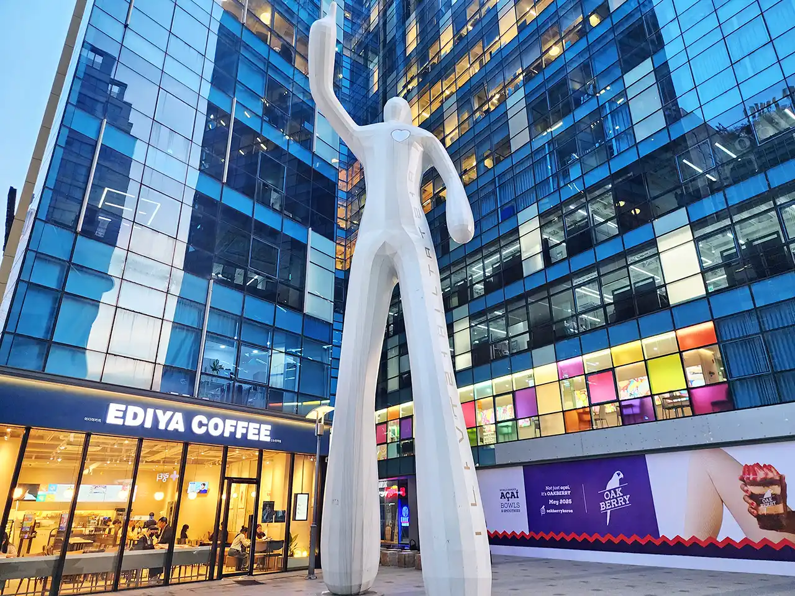

路边也经常能各种雕塑。这个白色巨人站在高楼夹角间指着对面的高楼，左胸前白色的爱心非常显眼。

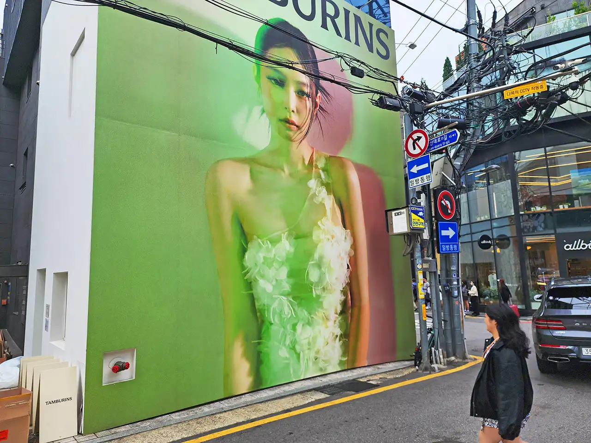

以及，一些网红打卡处，包括许多韩女团相关景点。

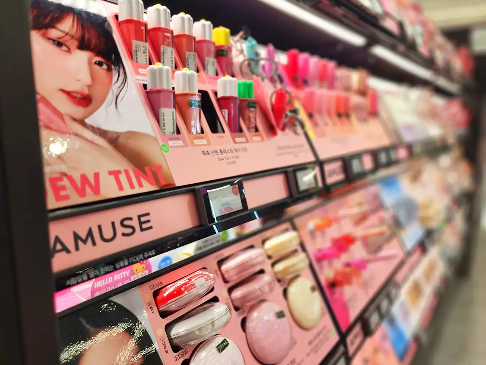

许多人来韩国，都和做脸与美妆等有关，当然这两者和我本人倒是没什么关系。与许多国家情况一样，免税店里非常多人。

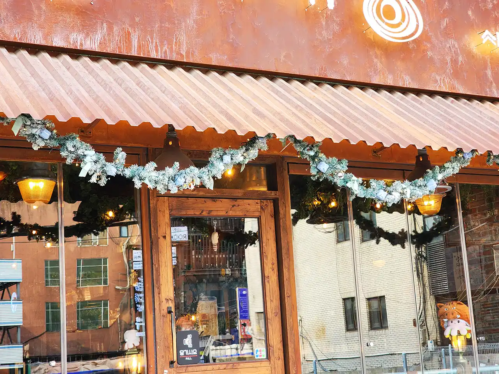

沿途商店非常之多，五花八门，内外装饰均很精致。这边的价格普遍比中国偏高一点，有一些要贵更多。

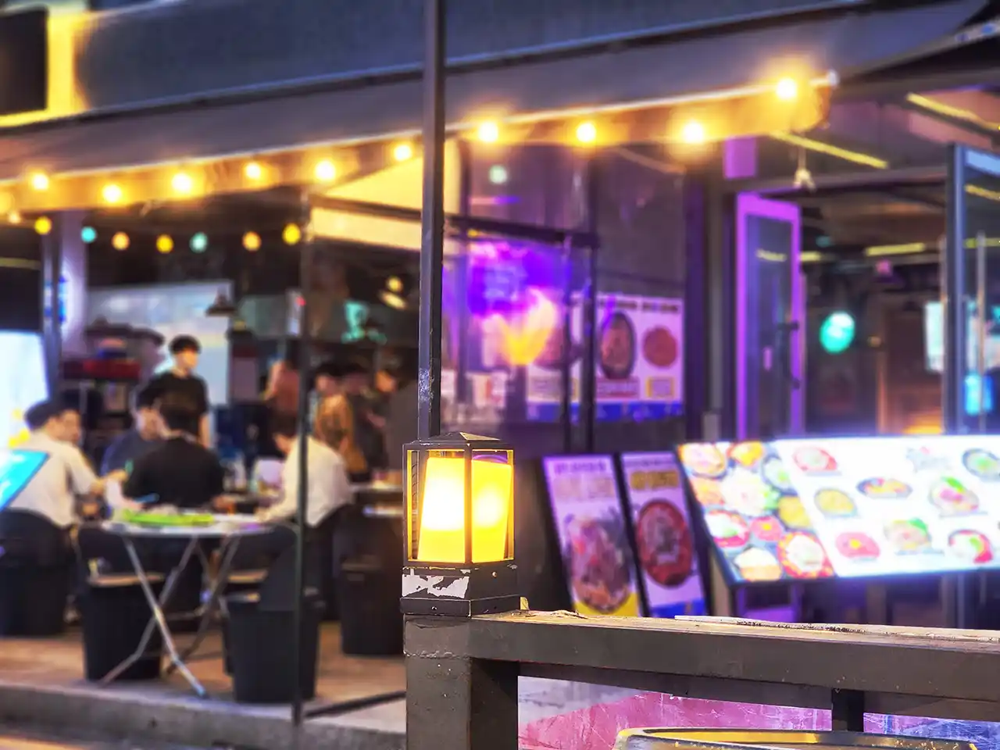

夜色降临，这些店铺亮起盏盏璀璨灯光，人群人往嘈杂热闹响起，仿佛这才是首尔江南的正确打开方式。

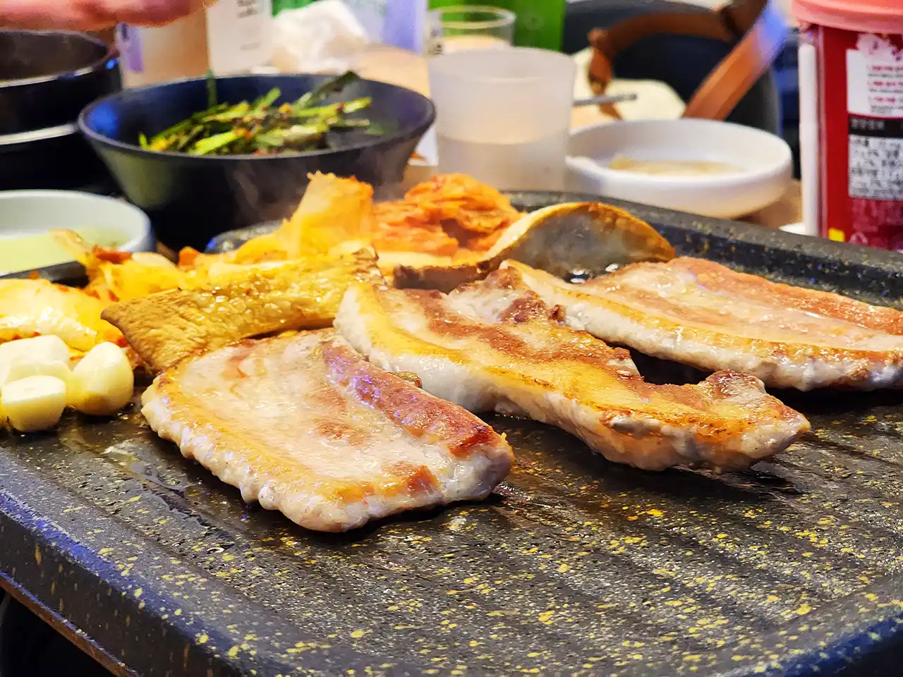

找家餐厅来份地道的韩国烤肉，服务人员里常能碰到东北朝鲜族人，可直接中文交流，在浓郁肉香和滋滋声中来协助烤肉，美拉德反应总是让人欲罢不能，幸福快乐油然而生。

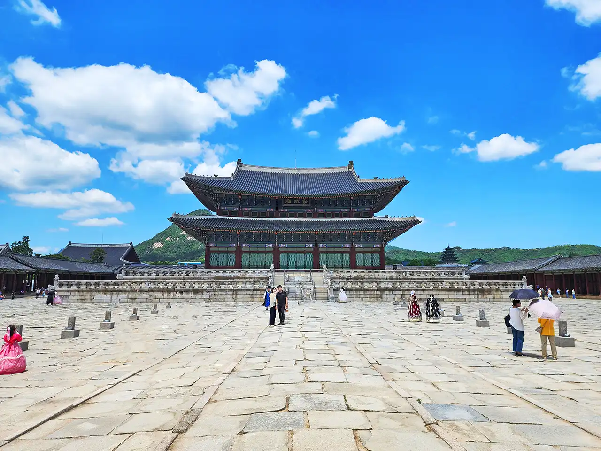

而景福宫是古时候朝鲜王国的王宫之一，自然也一定是会去，规模与紫禁城相比肯定是要小好几圈甚至都不在一个数量级的，但也是非常宏伟、颇具特色。总体来说，首尔可观光的地方不少，因此在这住了数天，游玩还是以休闲方式为主。
