看来夏日真的来了，骄阳之下温热轻微风浪阵阵袭来，前门大街两旁的树荫成为稍许可驻足之处，然行人游客并不少，在灰砖红柱墙间穿梭，人来人往。

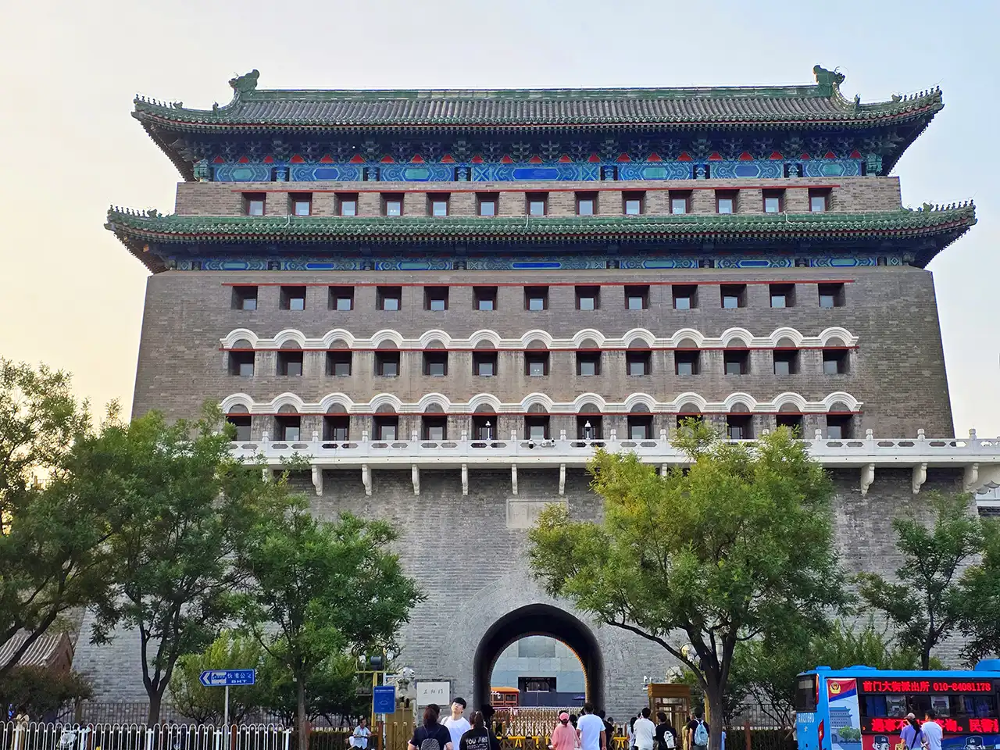

高大巍峨雄伟的简陋，在古时候显然能够独当一面，在城门前既是坚固城堡也是瞭望城楼，作为老北京城内城的正门，也承载着南中轴线重要一环，往北直通皇城方向，其上装潢涂饰也颇为用心，武将也修篇幅。现如今，这只是一个景点，更是文化传承记忆的一滴，在帝都安静地屹立，周围变化万千，留下时光微痕。

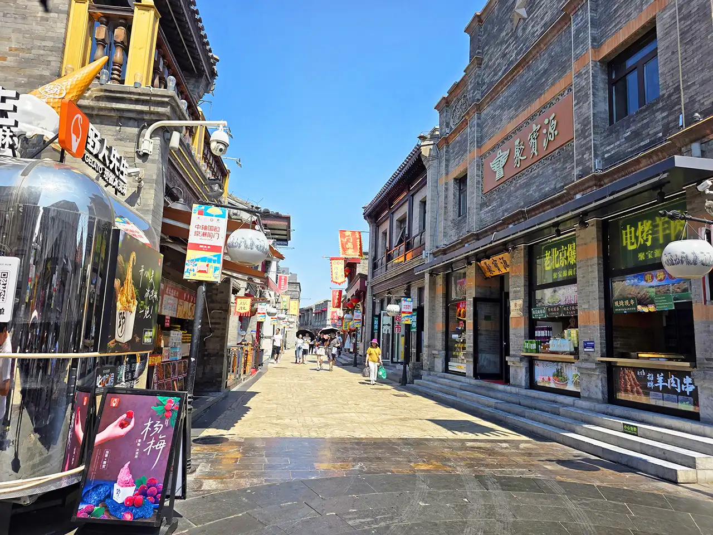

这一带的建筑物都是城墙风格的，加上一些京味古屋装饰嵌刻其中，也是一种设计特色。林林种种多少店铺布局棋盘中，大家安逸地品逛，却很难说清这里到底是喧闹还是宁静。

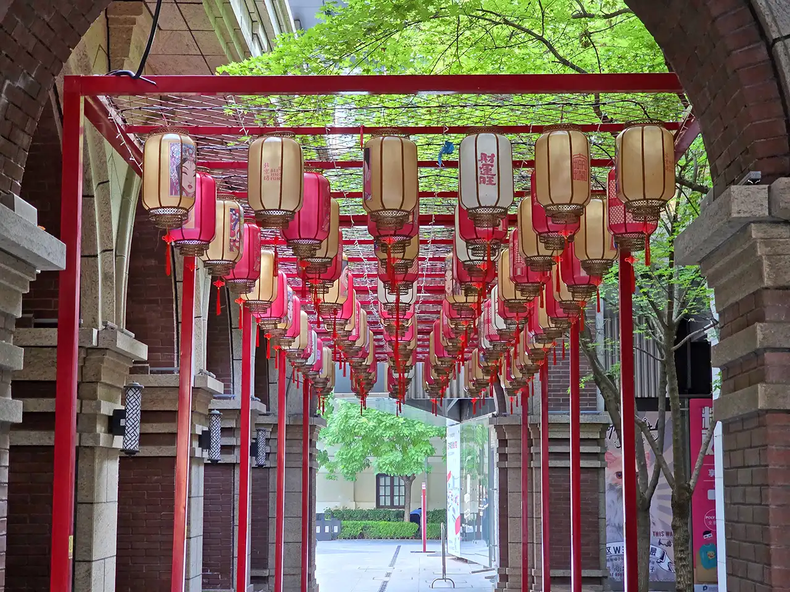

纵横道路盘杂于此，转个弯，拐条道，也有可能会是另一种格局风味。瞧这灯笼碧叶于红砖间，宁静雅致，散步悠然，好希望时间停滞。

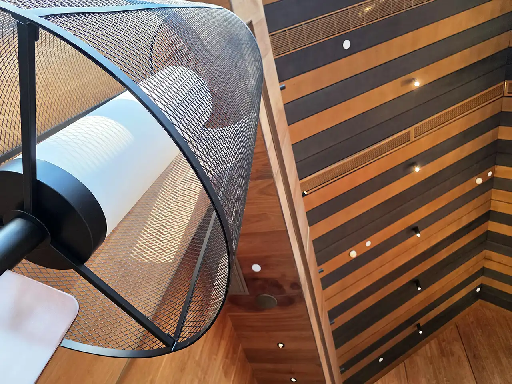

当年烘焙工坊首度初开时还时有光顾，后来上海南京西路开了一家更大的，便常去那边，这里的就没再来过了，直到这次，还是那份舒适而又保有格调的感觉，在木色和灯光中弥漫，在沙发和窗户边凝结，仿佛还是很多年前。

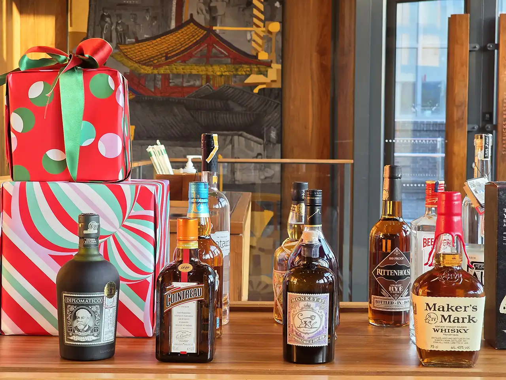

一般一杯红茶，不过毕竟刚经历过天热包裹，改为还是一杯甄选麦芽雪冷翠标准版吧，喜欢这种甜甜的味道。

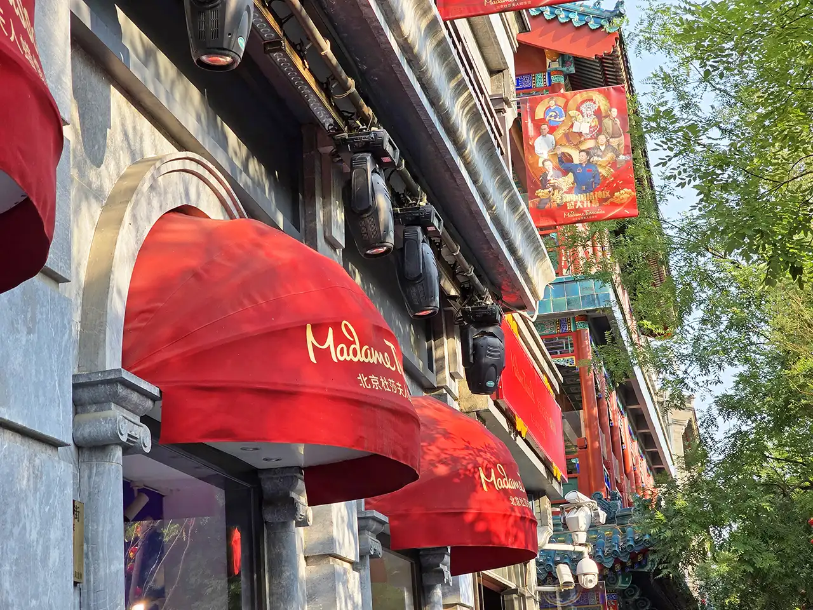

坐了许久，又重新获得活力，站在前门大街上，旁边的蜡像馆一如既往展示着几位著名演员，周围一群人称赞合影。咦，这次怎么里面有位穿着古装的小女孩，我靠近观摩，不料此人居然微微动了动身，朝我招招手，引我往前走。这一走，坏了，我撞到了橱窗玻璃上，不过没有疼痛，也没有撞击声，仿佛前面的玻璃软化了，四周似乎出现了扭曲，不知怎的，我一时没能回过神，却不自主地继续向前挪动了几步，来到了一个陌生的境界。

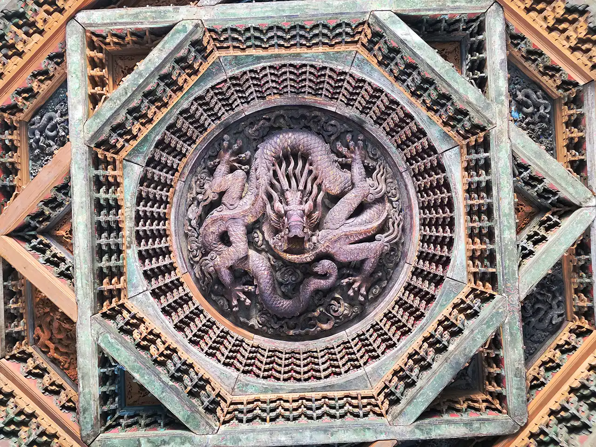

突然发现我正仰着头，上面雕刻着许多复杂而又精细的几何图案，中间一条巨龙盘踞于上，正向下看着我，似乎在传达什么重要的讯息，让我一时慌了神，这才突然惊醒了过来。

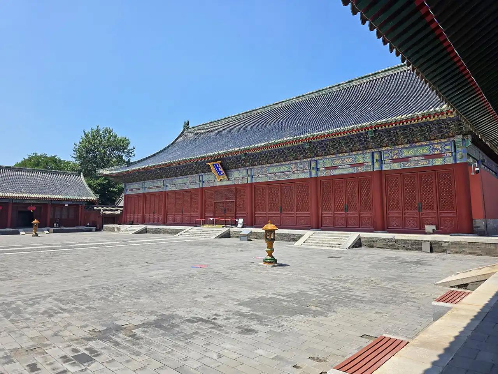

赶忙往夺门而出，面前是个广场，蓝琉璃瓦红墙殿围绕，似乎已不再之前所在前门，这分明是先农坛内坛中。此刻人不多，依然烈日当空。彷徨中，那古人拉着我说着什么，我问为何称呼我为网页，难道是因为直到我会写几个网页？此人道曰非也，实则喊我为王爷，还让我速速前往雍和宫，说是有要紧事。哎，这到底是发生了什么吗？

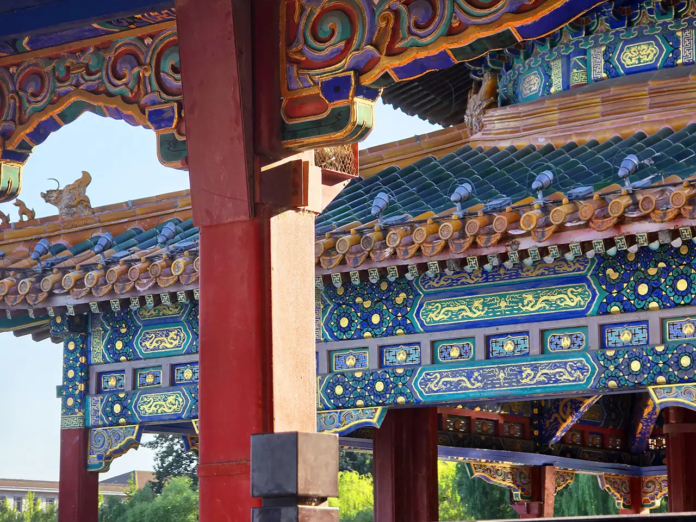

不知所措中来不及打听纠缠了，一路风驰电掣，朝北方向奔去，周围都回到了从前，其实也不怎么能分辨，现代北京的历史遗迹其实并不少，就算是后来造的很多也都是仿古设计。这走着走着，便来到了北海沿岸，精致的园林古建筑，仿佛数百年新旧如一。

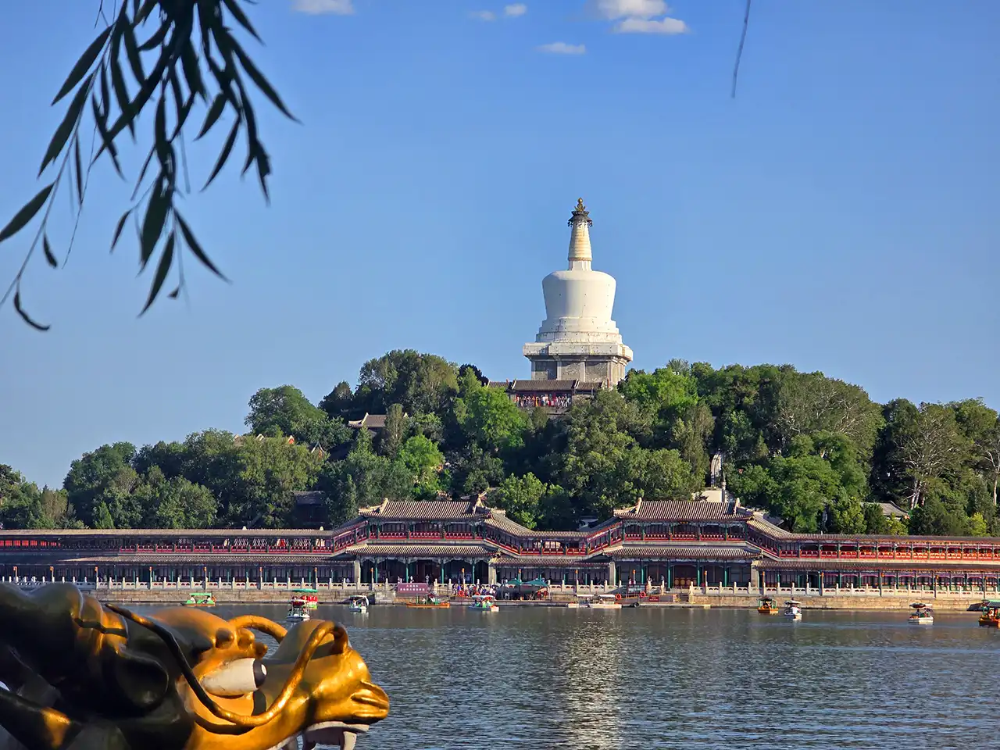

白塔非常醒目，在这靓丽湖光山色之间更是增添了不少视觉美感，自然人造景致赏心悦目，也在酷暑中营造出一份内心清凉之觉。

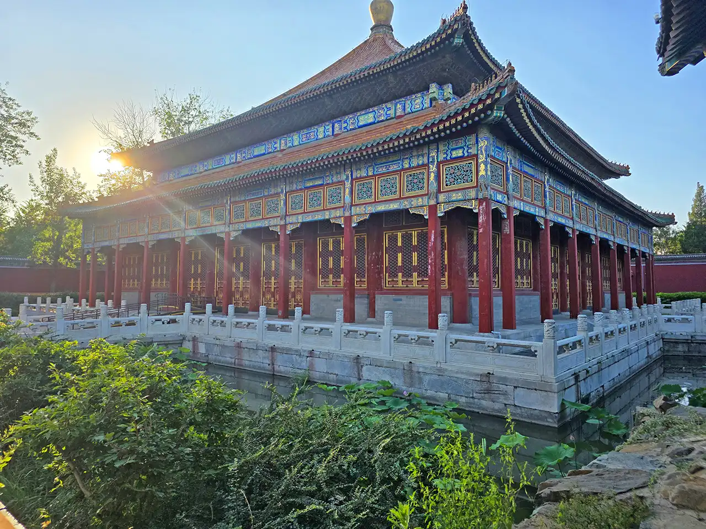

方亭式宫殿建筑小西天华丽宏大，水桥环于楠扇细镂花纹，月牙河上雕栏石桥跃，罗汉佛像与南海普陀勾勒出和谐人文与壮观自然。

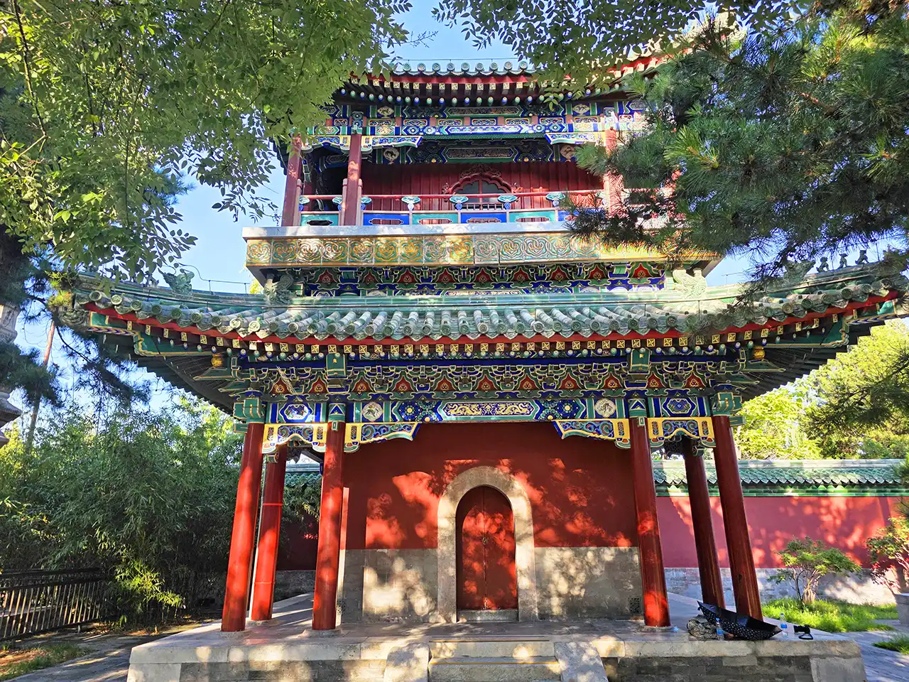

旁边不远便是大西天，穿过琉璃牌坊后的歇山黑琉璃黄剪边顶仿木结构券门山门，便是天王殿和经幢，整体建筑风格庄严璀璨，庭院内亭楼间鸟语花香，规模宏大，别有洞天。同时作为佛学文化圣地，也带来一丝心灵升化。

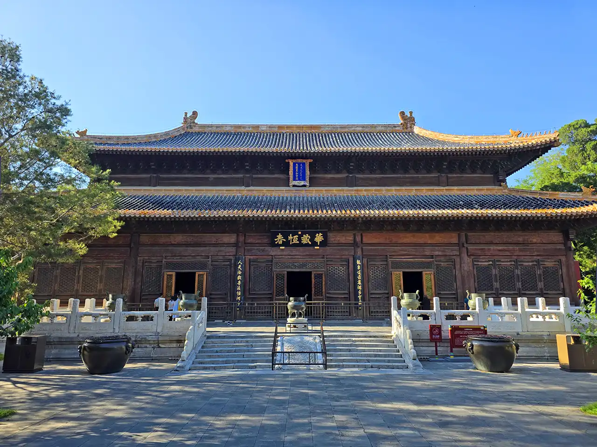

既然来到这里，自然要深入其内再探个究竟，毕竟气势磅礴如此巨大的金丝楠木大殿并不是那么多见的。深赭石色的建筑，带来一种很强烈的厚重感，让人心神镇定。

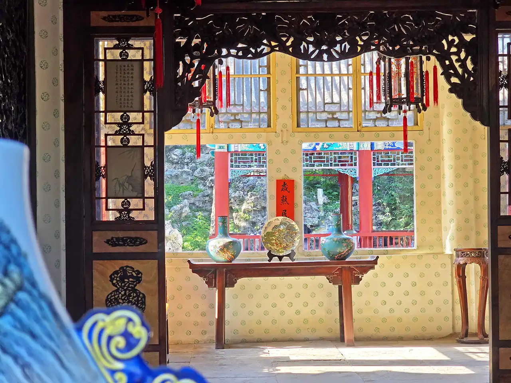

累了，方形水池边环绕的回廊中略作休息，镜花溪月，鱼游风轻，书香门第，如诗如画。一旁的古柯庭影颇有苏式美感，游走其间自然惬意，坐下休息，或左观右望，取来一些干食投喂水中鱼儿，任凭微风抚脸。

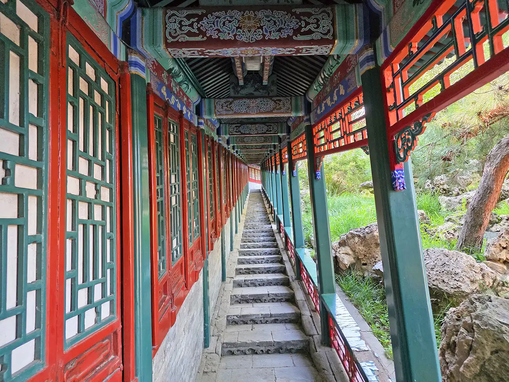

流连忘返，继续赶路，一路木漆石阶花草树亭。穿过北海和景山，继续沿着东北方向前进，很快酒来到了坐落于京师城内东北处的雍和宫。

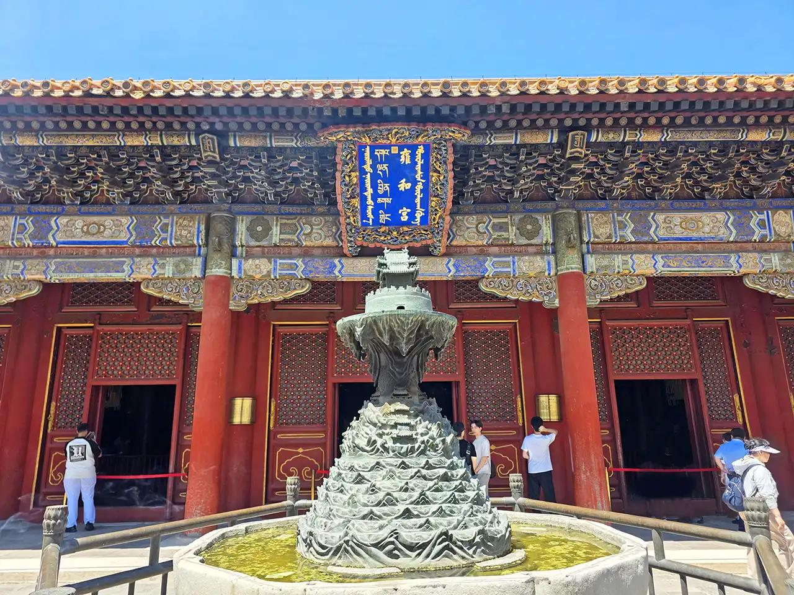

这里烟火缭绕，据说是龙潜福地，黄瓦红墙规格颇高，初为雍亲王府，后为清廷藏传佛教事务中心，飞檐斗拱古色古香，有殿宇千余间。在大殿前点香跪拜祈福。待睁眼起来时，四周回音渐清，猛然发现身上的朝服已是不见，但神情也没多少惊讶，这是又回到了现代，环顾四周发现香客不少，都心里默默有词。

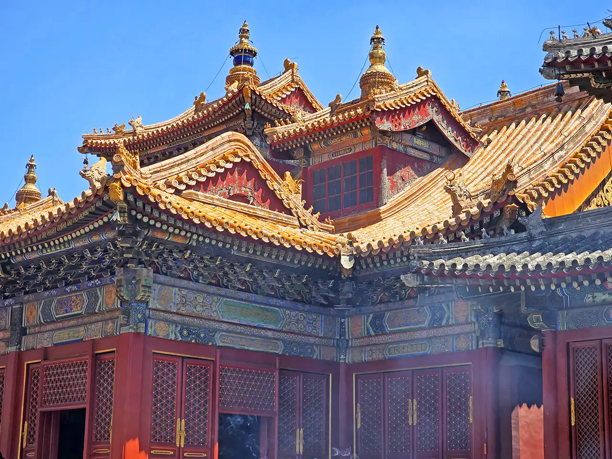

金色、红色、蓝色、绿色，华丽精致庄重的皇家风格，在这经久兴旺。突然间，我似乎明白了什么。蜡像馆里封印的是表皮，而这一路走来观赏的是建筑园林，期间与目的地的虔诚之旅，更让我内心触达到更深刻的思想，那是美好愿望的探寻，更是民族兴盛的前行。更确切地说，这是自我净化与领悟之旅。

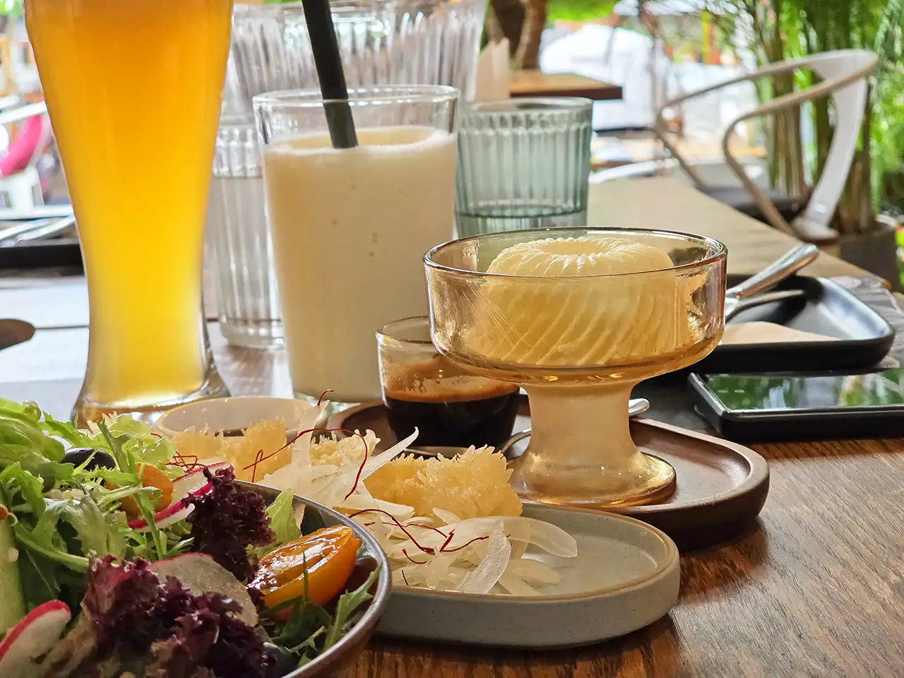

走出雍和宫，在五道营漫步几分，于一家西餐厅坐下，补充点能量和雅致，珍惜当下，而后继续发奋图强，披荆斩棘，毕竟人还是需要一些志向的。

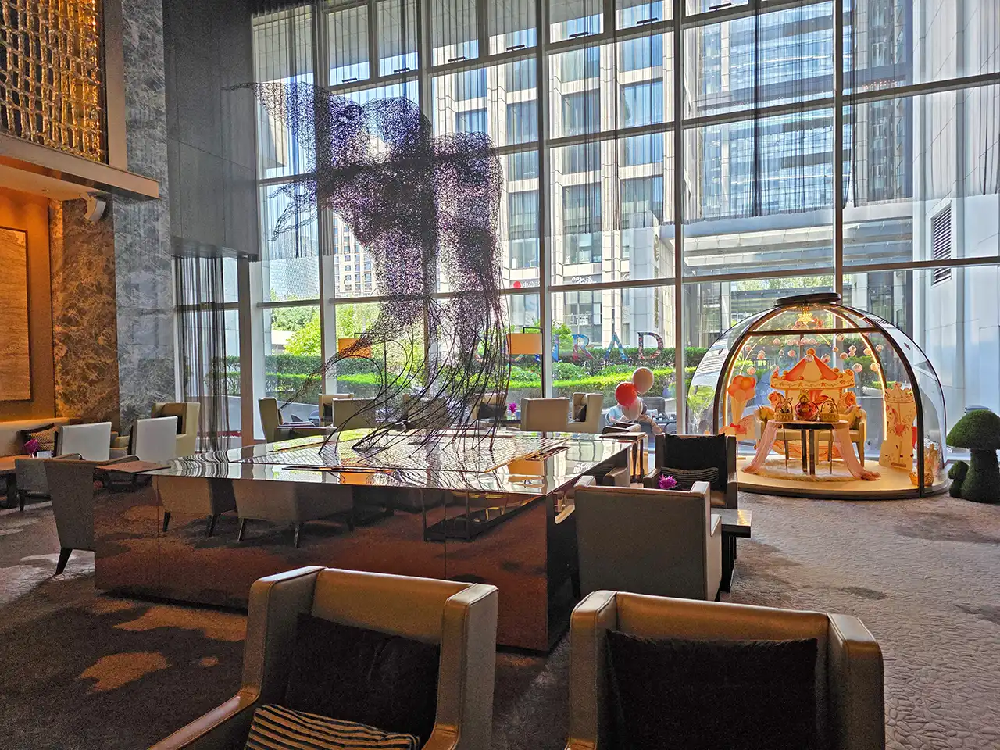

乘车回到不远处的酒店，夏日白昼时光再长也是有夜幕降临的那一刻，突然意识到一天奔波的疲惫，其实此时也并没觉得有什么。

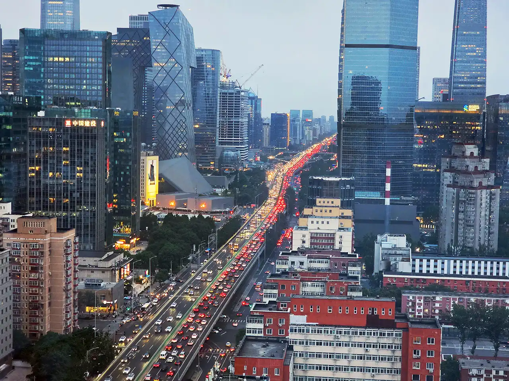

坐在行政酒廊的沙发上，吃着简单的晚餐，喝着果汁和茶，看着窗外川流不息车水马龙灯火通明的繁华都市摩登夜景，这都既是人们在为自己的理想奔波，也是对当下这一刻的享受，更是为社会事业添砖加瓦。

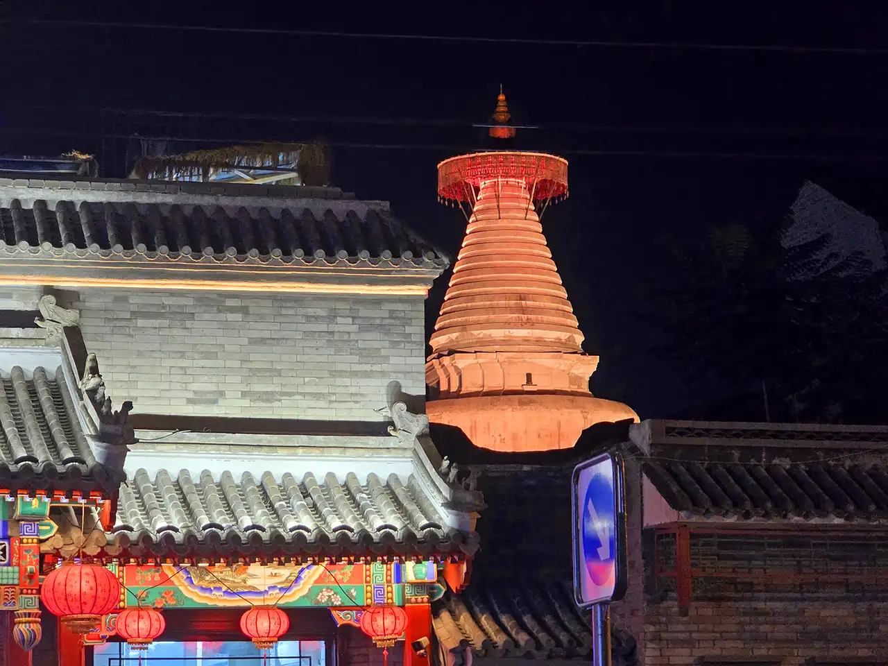

夜晚，白塔与老城垣下，灯笼照着的是现代科技赋予的生活，是人们新的活力，有我们的地方，都是龙潜福地。
